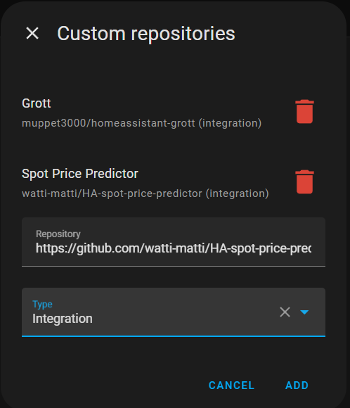
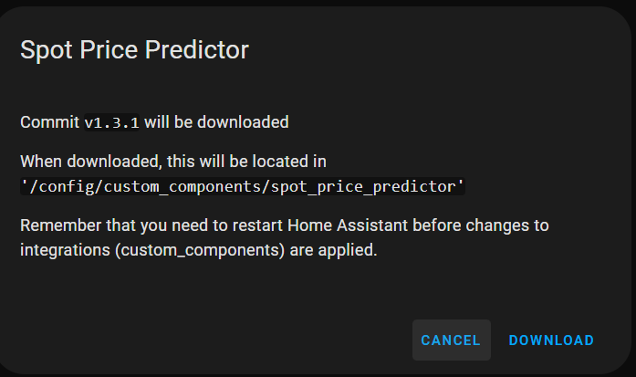
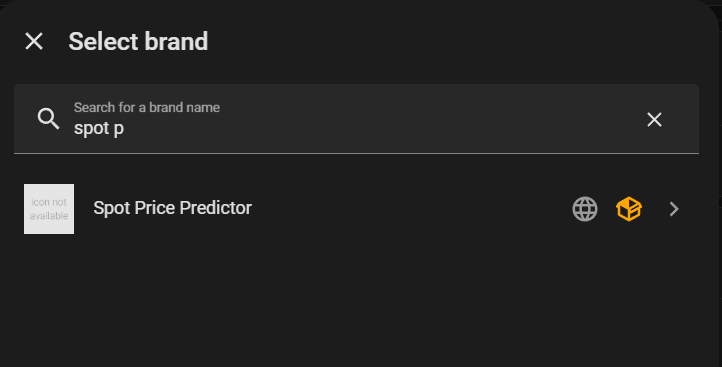
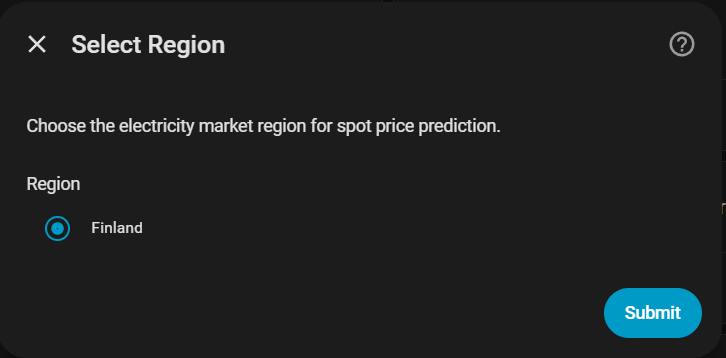
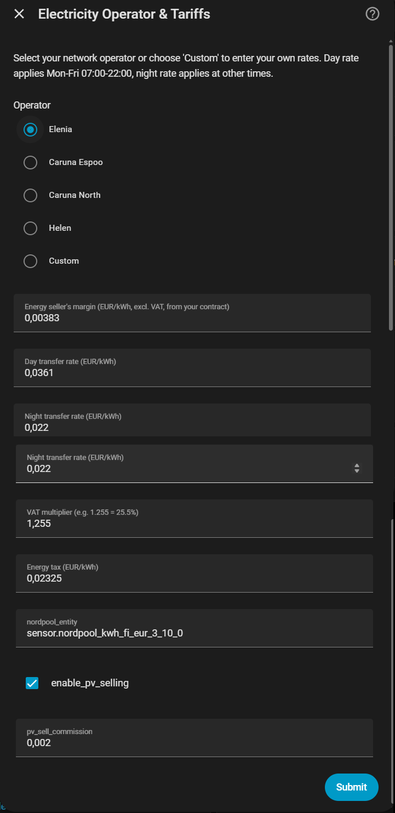
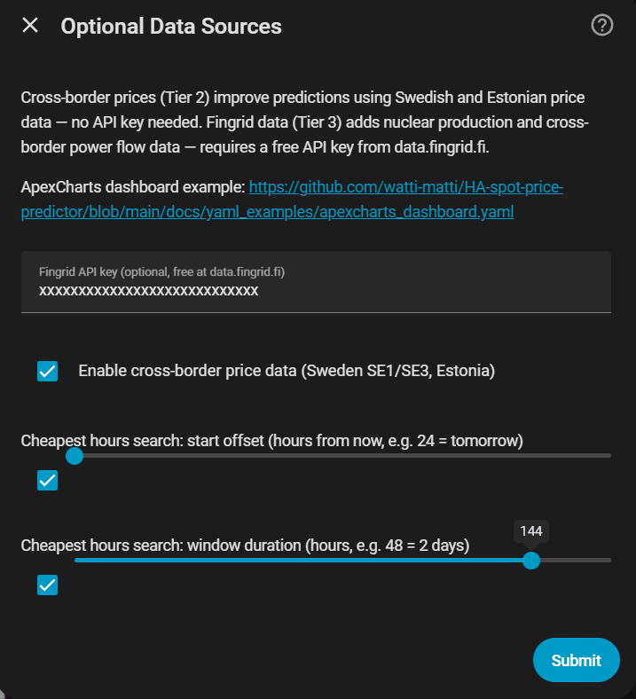
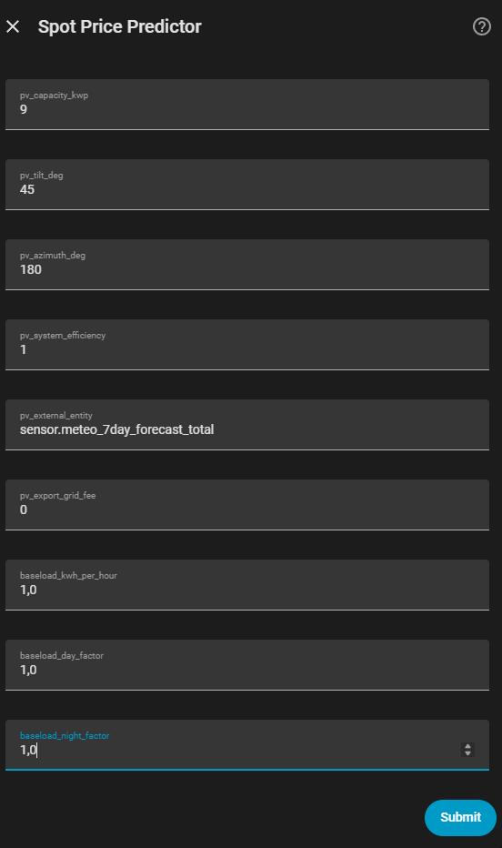
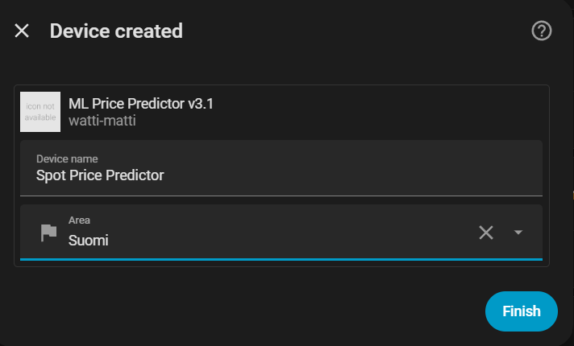
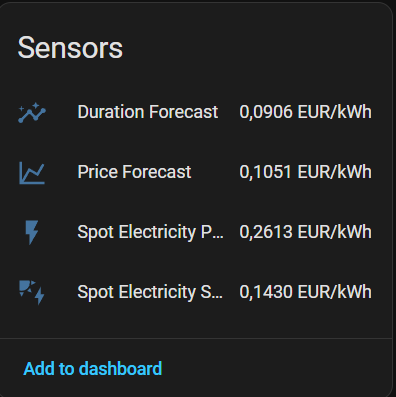
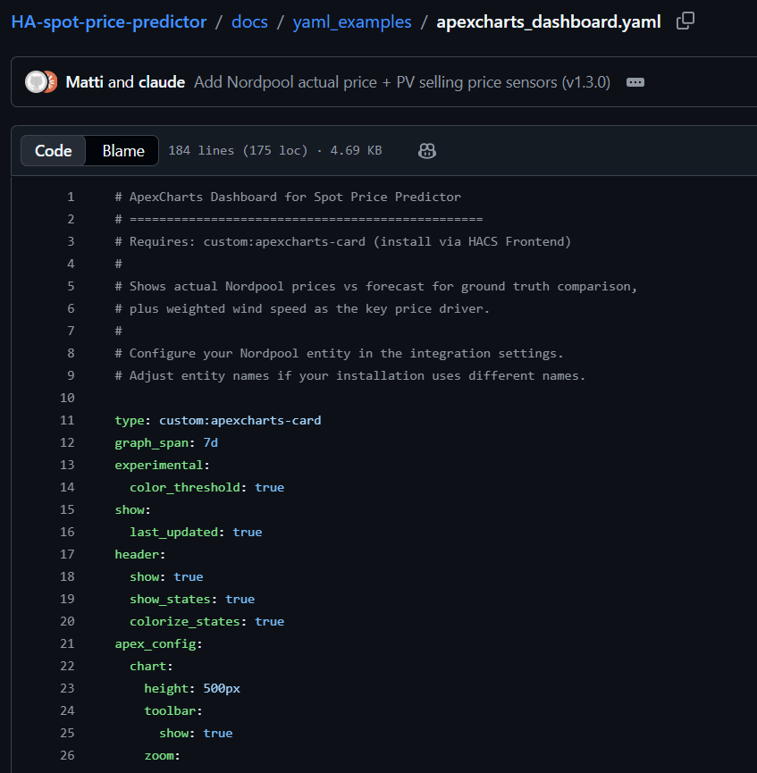

# Installation Guide / Asennusohje

Step-by-step installation guide for Spot Price Predictor.

## Prerequisites

- Home Assistant 2024.1.0 or newer
- [HACS](https://hacs.xyz/) installed
- Optional: [Nordpool integration](https://github.com/custom-components/nordpool) for actual price comparison
- Optional: [ApexCharts Card](https://github.com/RomRider/apexcharts-card) for dashboard (install via HACS Frontend)

## Step 1: Add Custom Repository to HACS

1. Open **HACS** → **Integrations**
2. Click the **⋮** menu (top right) → **Custom repositories**
3. Enter repository URL: `https://github.com/watti-matti/HA-spot-price-predictor`
4. Select type: **Integration**
5. Click **ADD**

## Step 2: Download the Integration

1. Find **Spot Price Predictor** in HACS Integrations
2. Click **Download**
3. The integration will be installed to `/config/custom_components/spot_price_predictor/`
4. **Restart Home Assistant** — this is required before the integration can be configured

## Step 3: Add the Integration

1. After restart, go to **Settings** → **Devices & Services**
2. Click **+ Add Integration** (bottom right)
3. Search for **"Spot Price Predictor"** (or type "spot p")
4. Click to start the configuration wizard

## Step 4: Select Region

Select your electricity market region. Currently supported: **Finland**.

Click **Submit** to continue.

## Step 5: Configure Operator, Tariffs, and Price Sources

This is the main configuration page where you set up your electricity pricing and optional data sources.

**Operator selection:**
- Select your network operator (**Elenia**, **Caruna Espoo**, **Caruna North**, **Helen**) — transfer rates are pre-filled
- Select **Custom** to enter your own day/night transfer rates

**Price parameters (all values excl. VAT):**
- **Energy seller's margin** — from your electricity contract (e.g., 0.00383 EUR/kWh)
- **Day transfer rate** — applies every day 07:00-22:00
- **Night transfer rate** — applies every day 22:00-07:00
- **VAT multiplier** — 1.255 for Finland (25.5%)
- **Energy tax** — 0.02325 EUR/kWh (class I, 2026)

**Nordpool integration (optional):**
- **Nordpool entity ID** — enter your Nordpool sensor entity (e.g., `sensor.nordpool_kwh_fi_eur_3_10_0`) to get actual price comparison sensors. Leave empty to skip.
- **Enable PV selling** — check if you have solar panels to get a selling price sensor
- **PV sell commission** — your electricity retailer's selling commission (e.g., 0.002 EUR/kWh = 0.2 c/kWh)

Click **Submit** to continue.

## Step 6: Optional Data Sources and Cheapest Hours

Configure prediction data sources and the cheapest hours search window.

**Data sources:**
- **Cross-border price data** — enabled by default. Uses free Swedish (SE1/SE3) and Estonian price data to improve predictions.
- **Fingrid API key** — optional. Register for free at [data.fingrid.fi](https://data.fingrid.fi) for nuclear production and cross-border flow data.

**Cheapest hours search window:**
- **Start offset** — hours from now to begin searching (default 24 = tomorrow)
- **Duration** — search window length in hours (default 48 = 2 days)

**ApexCharts dashboard:** A ready-made dashboard YAML is available at the link shown in the dialog. See [Step 8](#step-8-add-dashboard-optional) below.

Click **Submit** to complete the setup.

## Step 7: PV System Parameters (optional)

If you have rooftop solar, enter your PV system parameters here. Leave the capacity at 0 to skip and use the integration without PV awareness. With PV enabled, the forecast exposes a marginal effective price (bounded between sell and buy) and a PV-aware D(k) duration curve that reflects self-consumption savings.

## Step 8: Device Created

The integration creates a device called **Spot Price Predictor** with all sensors. You can assign it to an area (e.g., your home).

Click **Finish**.

## Step 9: Verify Sensors

Go to **Settings** → **Devices & Services** → **Spot Price Predictor** → **Sensors** to verify all sensors are working.

**Forecast sensors (always created):**

| Sensor | Description |
|--------|-------------|
| **Spot Price Forecast** | Predicted spot price (EUR/MWh) with 170h forecast |
| **Consumer Price** | Total consumer price (EUR/kWh) including all overhead |
| **Cheapest Hours** | Best time windows for scheduling flexible loads |
| **Week Price Stats** | Weekly min/avg/max consumer price |

**Spot price sensors (when Nordpool entity is configured):**

| Sensor | Description |
|--------|-------------|
| **Spot Electricity Price** | Actual consumer buying price from Nordpool |
| **Spot Electricity Selling Price** | Selling price for solar PV owners |

## Step 9: Add Dashboard (Optional)

Install [ApexCharts Card](https://github.com/RomRider/apexcharts-card) via HACS → Frontend, then copy the dashboard YAML from the repository:

The dashboard YAML is available at: [docs/yaml_examples/apexcharts_dashboard.yaml](docs/yaml_examples/apexcharts_dashboard.yaml)

To add it to your dashboard:
1. Go to your HA dashboard → **Edit** → **+ Add Card** → **Manual**
2. Paste the YAML content
3. Adjust entity names if your installation uses different names

The dashboard shows:
- **Actual consumer price** from Nordpool (step-line, color-coded) — ground truth
- **Forecast consumer price** (smooth line) — ML prediction
- **PV selling price** (yellow line) — for solar panel owners
- **Weekly average** reference line
- **Wind speed forecast** on secondary axis

## Changing Settings Later

You can change all settings after installation. Go to **Settings** → **Devices & Services** → **Spot Price Predictor** → **Configure** to modify:
- Operator and transfer rates
- Seller's margin
- Nordpool entity and PV settings
- Fingrid API key
- Cheapest hours search window

## Troubleshooting

**No sensors visible after installation:**
- Make sure you completed the full configuration wizard (Steps 3-6)
- Check **Settings** → **System** → **Logs** for errors containing `spot_price_predictor`
- Try removing the integration and adding it again

**Cheapest Hours shows "unavailable":**
- The search window (start + duration) may extend beyond the forecast range (170 hours). Reduce the values.

**Spot Electricity Price shows wrong values:**
- Verify that the Nordpool entity ID is correct in the configuration
- The sensor applies the same overhead (margin + transfer + tax + VAT) as the forecast consumer price

**Forecast seems inaccurate:**
- The bundled model was trained on recent Finnish data. For best accuracy, retrain quarterly — see [TECHNICAL_GUIDE.md](TECHNICAL_GUIDE.md#accuracy-and-retraining).

---

*[(Suomenkieliset tekniset ohjeet)](TEKNINEN_TOTEUTUS.md)*
