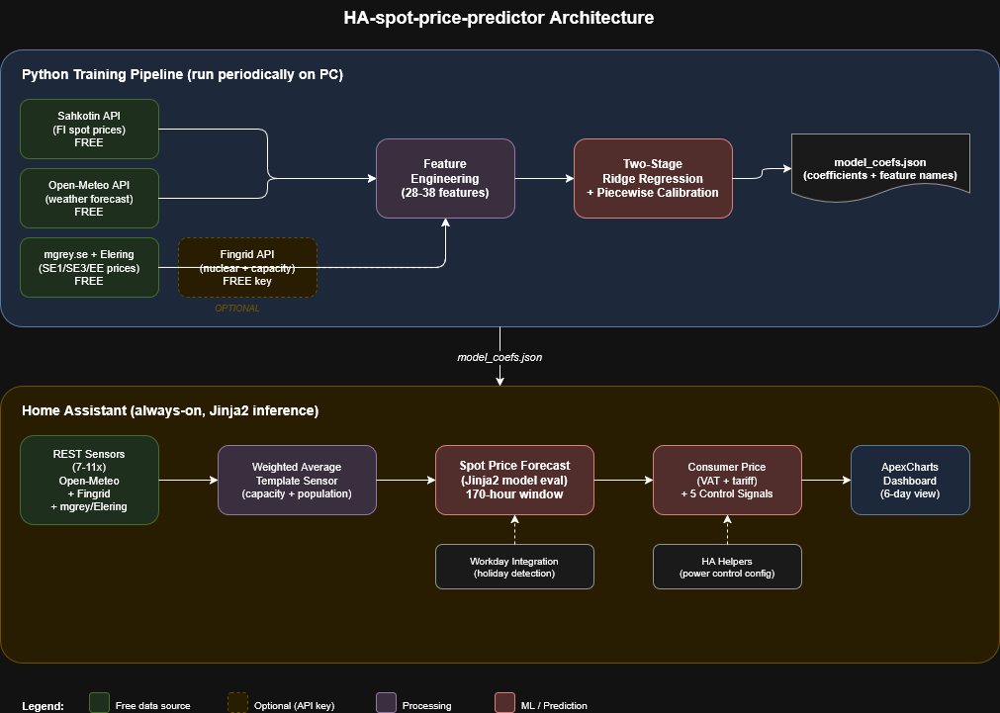
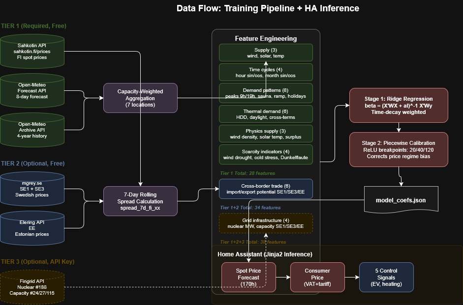

# Documentation: HA-spot-price-predictor

Finnish electricity spot price forecasting for Home Assistant using Ridge regression with physics-based features and multi-source data integration.

## Architecture

The system has two phases: **training** (Python, run periodically on PC) and **inference** (Home Assistant Jinja2 templates, always-on).



*Source: [docs/diagrams/architecture-overview.drawio](docs/diagrams/architecture-overview.drawio)*

### Training Pipeline

```
Sahkotin API ──┐
Open-Meteo API ─┼──> Feature Engineering ──> Two-Stage Ridge ──> model_coefs.json
mgrey.se API ───┤    (28-38 features)        Regression
Elering API ────┤
Fingrid API ────┘ (optional)
```

### Home Assistant Deployment

```
REST Sensors ──> Weighted Average ──> Spot Price Forecast ──> Consumer Price
(7-11x)          Template Sensor      (Jinja2 inference)      + Control Signals
                                                               + Dashboard
```



*Source: [docs/diagrams/data-flow.drawio](docs/diagrams/data-flow.drawio)*

---

## Data Sources

### Required (free, no authentication)

| Source | Purpose | Rate Limit |
|--------|---------|------------|
| [Sahkotin API](https://sahkotin.fi/prices) | FI Nord Pool spot prices (EUR/MWh) | Unlimited |
| [Open-Meteo API](https://api.open-meteo.com) | Wind (120m), solar (45 tilt), temperature | 10,000/day |
| [Open-Meteo Archive](https://archive-api.open-meteo.com) | Historical weather for training | 10,000/day |

### Cross-border price sources (free, no authentication)

| Source | Zones | Purpose |
|--------|-------|---------|
| [mgrey.se](https://mgrey.se/espot/api) | SE1, SE3 | Swedish spot prices for spread calculation |
| [Elering API](https://dashboard.elering.ee/api/nps/price) | EE | Estonian spot prices for spread calculation |

Used to compute 7-day rolling price spreads and derive `import_potential_xx` / `export_potential_xx` features. Analysis confirmed strong autocorrelation (lag-1 weekly r=0.54-0.73, sign persistence 100%).

### Optional grid data (free API key)

| Source | Purpose |
|--------|---------|
| [Fingrid Open Data](https://data.fingrid.fi) | Nuclear production (#188), transmission capacity SE1-FI (#24), SE3-FI (#27), EE-FI (#115) |

Register for free at data.fingrid.fi. Without this key, the model trains on Tier 1+2 features only.

---

## Feature Engineering

### Tier 1: Base features (28) -- no API keys needed

| Category | Count | Features |
|----------|-------|----------|
| Supply-side | 3 | `wind_speed_weighted`, `solar_irradiance_weighted`, `temperature_weighted` |
| Time cycles | 4 | `hour_sin/cos`, `month_sin/cos` |
| Demand patterns | 8 | `double_peak_am/pm` (Gaussian, center 9h/19h), weekend variants, `sauna_hour`, `monday_ramp`, `is_holiday`, `is_weekend` |
| Thermal demand | 6 | `hdd`, `hdd_sq`, `daylight_deficit`, cross-terms (`wind_x_hdd`, `solar_x_deficit`, `temp_x_hdd`) |
| Physics supply | 3 | `wind_power_density` (density-corrected), `solar_power_temp` (NOCT model), `renewable_surplus` |
| Scarcity | 4 | `scarcity_indicator`, `wind_drought_penalty`, `cold_morning_stress`, `cold_calm_dark` (Dunkelflaute) |

### Tier 2: Cross-border trade features (6) -- no API keys needed

Derived from 7-day rolling average price spreads:

| Feature | Formula | Meaning |
|---------|---------|---------|
| `import_potential_se1` | max(0, spread_7d_fi_se1) | Price incentive to import from SE1 |
| `import_potential_se3` | max(0, spread_7d_fi_se3) | Price incentive to import from SE3 |
| `import_potential_ee` | max(0, spread_7d_fi_ee) | Price incentive to import from EE |
| `export_potential_se1` | max(0, -spread_7d_fi_se1) | Price incentive to export to SE1 |
| `export_potential_se3` | max(0, -spread_7d_fi_se3) | Price incentive to export to SE3 |
| `export_potential_ee` | max(0, -spread_7d_fi_ee) | Price incentive to export to EE |

### Tier 3: Grid infrastructure features (0-4) -- requires Fingrid API key

| Feature | Source | Normalization |
|---------|--------|---------------|
| `nuclear_mw` | Fingrid #188 | 0-1 (0-4372 MW) |
| `import_capacity_se1` | Fingrid #24 | 0-1 (0-1500 MW) |
| `import_capacity_se3` | Fingrid #27 | 0-1 (0-1200 MW) |
| `import_capacity_ee` | Fingrid #115 | 0-1 (0-1016 MW) |

### Feature count by configuration

| Configuration | Features | API keys |
|---------------|----------|----------|
| Tier 1 only | 28 | None |
| Tier 1 + 2 | 34 | None |
| Tier 1 + 2 + 3 | 38 | 1 (Fingrid, free) |

---

## Model Architecture

### Two-stage Ridge regression with piecewise calibration

**Stage 1 (base model):**
- Linear polynomial (degree 1) on 28-38 features
- Weighted normal equations: beta = (X'WX + alpha*I)^(-1) X'Wy
- Time-decay weighting: w(t) = exp(-ln2 * age_hours / (365 * 24))
- Ridge alpha = 1.0

**Stage 2 (piecewise calibration):**
- Augmented features: stage1_prediction + 3 ReLU breakpoints
  - pw_relu_20 = max(0, s1 - 20)
  - pw_relu_40 = max(0, s1 - 40)
  - pw_relu_120 = max(0, s1 - 120)
- Corrects systematic bias at different price regimes

**Training:** 4 years historical data, 85/15 time-ordered split, batch processing (512 rows).

**Output:** `model_coefs.json` containing stage 1 + stage 2 coefficients, feature names, and tier info.

---

## Consumer Price & Control Signals

**Formula:** `(spot_EUR_MWh / 1000 + transfer_rate + energy_tax) x VAT`

Configurable per operator in `finland.yaml`. Default: Elenia (day 5.60, night 4.30 c/kWh), VAT 25.5%, energy tax 2.253 c/kWh.

**Sensors:**

| Sensor | Unit | Description |
|--------|------|-------------|
| Spot Price Forecast | EUR/MWh | Current predicted price + 170h forecast attribute |
| Consumer Price | EUR/kWh | Total price including transfer tariff, VAT, energy tax |
| Cheapest Hours | timestamp | Cheapest 1h/2h/3h/4h/6h/8h blocks + hours below average |
| Week Price Stats | EUR/kWh | Min/avg/max consumer price over forecast window |

The **Cheapest Hours** sensor is the primary automation tool. Its attributes provide start times and average prices for the cheapest consecutive N-hour blocks within the next 24 hours, plus a list of all hours with below-average prices. This is useful for scheduling controllable loads (EV charging, water heating, heat pumps) to the cheapest time windows.

---

## Home Assistant Integration

### Holiday and workday detection

The model uses workday/holiday status to select demand patterns (workday peaks vs weekend/holiday peaks). Two options are supported and the integration can switch between them via the `holidays.ha_workday_integration` setting in the region config.

#### Option A: HA Workday integration (recommended)

Uses Home Assistant's built-in [Workday integration](https://www.home-assistant.io/integrations/workday/) which automatically resolves public holidays from community-maintained calendars.

**Setup:**
1. Go to **Settings** → **Devices & Services** → **Add Integration** → search **Workday**
2. Set **Country** to `FI` (Finland)
3. Leave defaults (excludes holidays and weekends from workdays)
4. The integration creates `binary_sensor.workday_sensor` — **on** = workday, **off** = holiday/weekend

**How the predictor uses it:**
- The coordinator calls `workday.check_date` service for each hour in the 170h forecast window
- This returns whether each future date is a workday, accounting for all Finnish public holidays
- No hardcoded holiday lists to maintain — the Workday integration updates automatically with HA releases

**Switching to Option A:** Set `holidays.ha_workday_integration: true` in `finland.yaml`. This is the default.

#### Option B: Built-in holiday calculator

Uses the holiday rules defined in the region config file (`finland.yaml`) with a built-in Easter algorithm and special date rules.

**Included Finnish holidays:**
- Fixed: New Year, Epiphany, May Day, Independence Day, Christmas Eve/Day/Boxing Day
- Easter-relative: Good Friday, Easter Sunday/Monday, Ascension, Whit Sunday
- Special rules: Midsummer Eve (Fri Jun 19-25), All Saints (Sat Oct 31 - Nov 6)

**When to use Option B:**
- Testing the model outside of Home Assistant (training pipeline always uses Option B)
- Home Assistant instance without the Workday integration installed
- Deploying to a region not yet supported by the Workday integration's holiday library

**Switching to Option B:** Set `holidays.ha_workday_integration: false` in `finland.yaml`. The built-in calculator will be used for both training and HA inference.

### Sensors by tier

All sensors are generated by `generate_ha_yaml.py` based on the trained model's active tiers.

**Tier 1 (always present):** 7 Open-Meteo REST sensors, weighted average, spot price forecast, consumer price.

**Tier 2 (if active):** 3 cross-border price REST sensors (mgrey.se, Elering), spread calculation template.

**Tier 3 (if active):** 4 Fingrid REST sensors (nuclear, SE1, SE3, EE capacity).

---

## Regional Localization

The system is driven by a single region config file (`config/regions/finland.yaml`). To support a new region:

1. **Identify weather measurement locations** — find 5-8 geographical locations in the target country that represent the dominant regions for wind power, solar power, and energy consumption. These locations are weighted by installed capacity (wind, solar) and population (temperature/demand). See the AI prompt template below.
2. **Create a new YAML file** (e.g., `sweden.yaml`) with the identified locations, weights, and local parameters
3. **Define local price API** — find a free API providing day-ahead spot prices for the target bidding zone
4. **Configure holidays** — add fixed dates, Easter-relative dates, and any country-specific special rules
5. **Add neighboring price sources** for cross-border features
6. **Set consumer pricing** — VAT rate, energy tax, and distribution operator tariffs
7. **Run training** with `--region sweden`

Optional data sources are skipped gracefully if their API key is missing or if the region config omits them.

### Finding weather locations for a new region

The quality of predictions depends on choosing representative locations that capture the geographical distribution of renewable generation and consumption. Use the following AI prompt template to identify locations for a new country:

<details>
<summary><b>AI prompt template (click to expand)</b></summary>

```
I am building an electricity spot price prediction model for [COUNTRY] that uses
weather data (wind speed, solar irradiance, temperature) from multiple locations
weighted by installed generation capacity and population.

Please identify 5-8 representative weather measurement locations for [COUNTRY] with
the following requirements:

For each location provide:
- Name and description (nearby city or region name)
- Latitude and longitude (decimal degrees)
- Wind weight (0-1): proportional to installed/planned wind power capacity in the area
- Solar weight (0-1): proportional to installed/planned solar PV capacity in the area
- Temperature weight (0-1): proportional to population density (drives consumption)

Location selection criteria:
1. WIND: Include the largest wind power clusters (both onshore and offshore where
   applicable). Use national wind power association data or grid operator statistics
   for installed capacity by region.
2. SOLAR: Include regions with the largest solar PV installations (utility-scale farms
   and dense rooftop solar areas). Use energy authority registers for installed capacity.
3. TEMPERATURE: Weight by population density since residential heating/cooling drives
   electricity demand. The capital region typically gets the highest temperature weight.
4. GEOGRAPHIC SPREAD: Ensure locations span the country to capture weather diversity.
   Wind conditions on the coast vs inland, solar irradiance north vs south.
5. WEIGHTS: Wind weights should sum to approximately 0.8-1.0 (some residual captured
   by proximity). Solar weights should sum to approximately 0.9-1.0. Temperature
   weights should sum to approximately 0.8-1.0.

Also provide:
- The representative latitude for daylight hour calculation (country centroid)
- The HDD (Heating Degree Day) base temperature appropriate for the country's
  building stock
- Whether cooling demand (CDD) is significant and should be modeled
- The dominant bidding zone(s) for the electricity market

Please cite sources for capacity data where possible.
```

</details>

**Example: Sweden prompt** — Replace `[COUNTRY]` with `Sweden` and add:

```
Additional context for Sweden:
- Four bidding zones: SE1 (north), SE2 (central-north), SE3 (central-south), SE4 (south)
- I am primarily interested in SE3 (Stockholm region, highest consumption)
- Major wind power regions: Norrland coast, Gotland, Skåne
- Solar is growing but still small compared to wind and hydro
- Include at least one location per bidding zone
- Note that Sweden has significant hydropower which is not weather-dependent
  in the same way — focus on wind/solar locations
```

---

## Accuracy Targets

| Configuration | Expected MAE | Notes |
|---------------|-------------|-------|
| Tier 1 (28 features) | ~29-30 EUR/MWh | Matches existing v3 baseline |
| Tier 1+2 (34 features) | ~25-28 EUR/MWh | Cross-border spreads help |
| Tier 1+2+3 (38 features) | ~22-26 EUR/MWh | Nuclear + capacity for extremes |

Evaluation uses time-ordered 85/15 split with hourly, monthly, and segment-level (peak/off-peak, workday/weekend) breakdown.

---

## Project Structure

```
HA-spot-price-predictor/
├── README.md
├── TECHNICAL_GUIDE.md           # This document
├── docs/diagrams/               # draw.io architecture diagrams
├── requirements.txt
├── .env.example                 # FINGRID_API_KEY placeholder
├── .gitignore
├── src/
│   ├── train_model.py           # Main entry point
│   ├── features.py              # Dynamic feature engineering
│   ├── data_sources.py          # API clients (config-driven)
│   ├── holidays.py              # Holiday calculator
│   ├── generate_ha_yaml.py      # HA YAML generator
│   └── evaluate.py              # Metrics + visualization
├── config/regions/
│   └── finland.yaml             # Finnish region config
├── homeassistant/               # Generated HA sensor YAML
└── output/                      # Generated model artifacts
```
