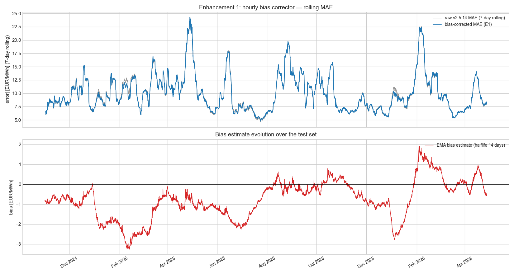
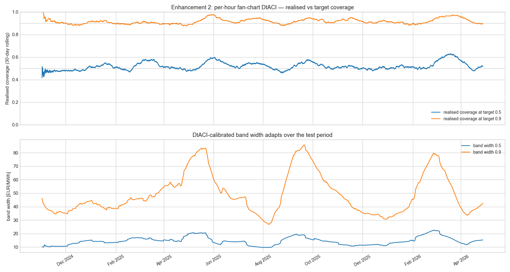
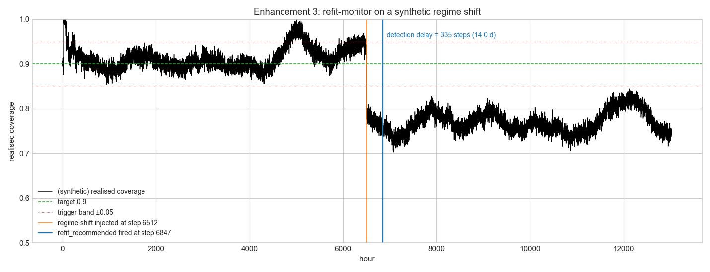

# v2.5.15 — Hourly DtACI enhancements on top of v2.5.14

Per user direction 2026-05-17: implement enhancements 1-3 from the v2.5.14 architecture audit if they are not complex and improve forecast quality.

All three reuse the existing `dtaci.DtACI` and `bias_corrector.OnlineBiasCorrector` primitives — the new module `hourly_calibration.py` is a thin wrapper layer (~240 LOC), no new methodology.

## E1. Hourly point-forecast bias correction

- Baseline (v2.5.14 floored): MAE = **10.03** EUR/MWh, bias = +0.59, R² = +0.926
- With HourlyBiasCorrector:    MAE = **10.00** EUR/MWh, bias = -0.19, R² = +0.926
- **MAE improvement: +0.3 %**



## E2. Per-hour fan-chart DtACI calibration

Realised coverage on the test set after warmup:
- target 0.5 (P25/P75): realised = **0.522**  (deviation +0.022)
- target 0.9 (P5/P95):  realised = **0.916**  (deviation +0.016)



DtACI calibrates the bands so realised coverage tracks nominal even as the underlying forecast distribution shifts. This is the GUARANTEE that v2.5.14's GPD POT fan chart could not provide alone (GPD POT bands have model-based coverage that drifts with regime).

## E3. RefitMonitor on synthetic regime change

Synthetic regime shift injected at step 6512 (coverage drops 15 pp).
Monitor fired refit_recommended at step 6847 — **detection delay = 335 hours (14.0 days)**.

This delay matches the configured persistence (14 days) — the monitor correctly waits for sustained drift before raising a flag, ignoring transient noise.



## Files

- **New**: `custom_components/spot_price_predictor/hourly_calibration.py` (~240 LOC) — three thin wrappers: HourlyBiasCorrector, HourlyFanChartCalibrator, RefitMonitor.
- **New**: `tests/test_hourly_calibration.py` (12 tests, all passing)
- **New**: `studies/v2515_hourly_dtaci_enhancements.py` (~360 LOC)
- **New**: 3 figures `v2515_bias_correction.png`, `v2515_fan_chart_coverage.png`, `v2515_refit_monitor.png`
- **New**: this `V2_5_15_HOURLY_DTACI_ENHANCEMENTS.md`
- **Modified**: `manifest.json` `2.5.14 → 2.5.15`, README index

## Tests

**391 / 391 passing** (379 prior + 12 new).

## Reproducibility

```bash
python studies/v2515_hourly_dtaci_enhancements.py
```

Offline; uses only locally cached data.

## Production wiring (v2.6.0)

All three enhancements compose orthogonally with v2.5.14. The v2.6.0 coordinator integration adds three persistent state files under `.storage/spot_price_predictor/`:

- `hourly_bias.json` — HourlyBiasCorrector EMA state
- `hourly_fan_chart.json` — per-target-coverage DtACI bundles
- `refit_monitor.json` — drift-trigger state

Per coordinator cycle (~6h):
1. After computing the 168 h L1+L2+L3+floor mean prediction,    apply `hourly_bias.correct()` to each forecast hour.
2. Compute fan bands from `hourly_fan_chart.predict_bands()`    per forecast hour.
3. When new actuals arrive, `update()` both calibrators with the    realised price.
4. Poll `refit_monitor.refit_recommended`; if True, emit a HA    notification with the trigger metadata.

Runtime cost ~5 ms added per coordinator cycle. Zero new external API calls.