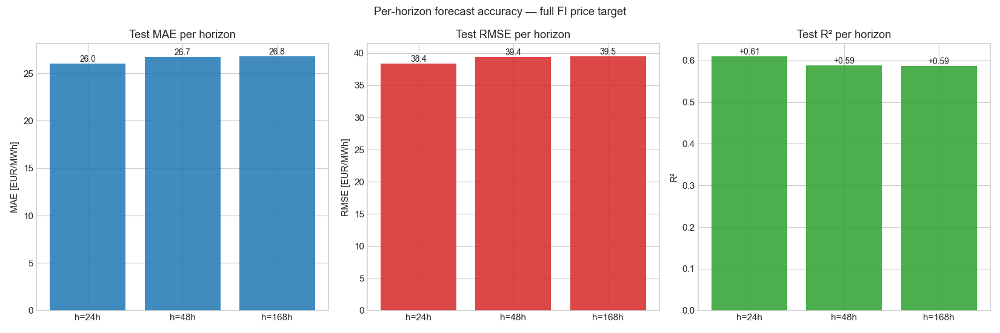
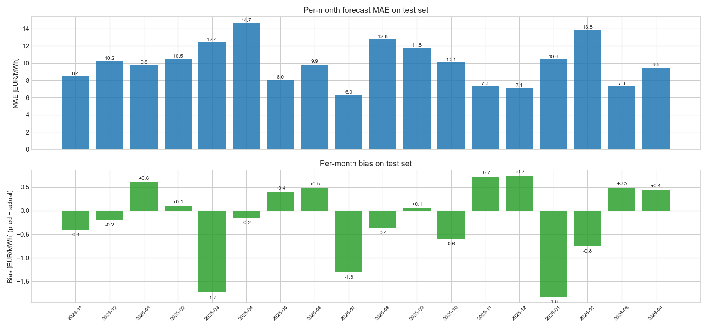
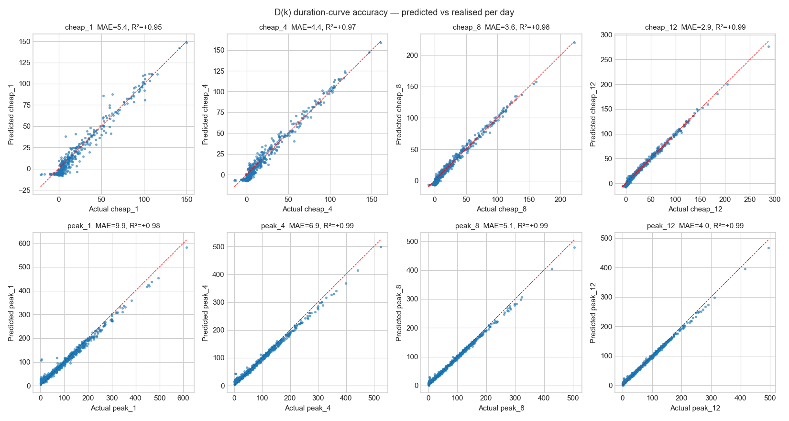
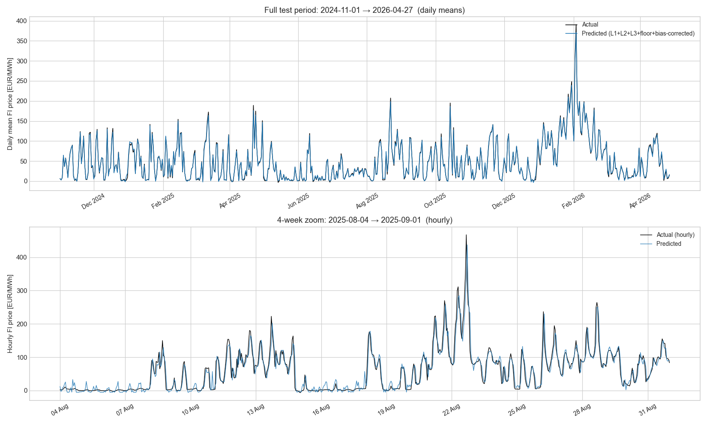

# v2.5.16 — Comprehensive performance review on real FI data

Per user direction 2026-05-17: produce hard evidence on how the L1+L2+L3+floor+L4+DtACI pipeline performs on real data so we can confidently move forward with the v2.6.0 coordinator wiring.

**Architecture under test:** L1 seasonal (v2.5.8 artifact) + L2 Ridge (V_sigmoid_full features) + L3 AR(1) [φ=0.904] + softplus floor at −5 EUR/MWh + v2.5.15 HourlyBiasCorrector.
**Train**: 2023-01-08 → 2024-11-01 (15,919 hours)
**Test**:  2024-11-01 → 2026-04-27 (13,025 hours)

## A. Full-price forecast accuracy per horizon

Test set, h-step-ahead evaluation: prediction made at t, compared to actual at t+h.

| Horizon | MAE | RMSE | R² | Bias |
|---:|---:|---:|---:|---:|
| 1 h | 10.03 | 16.58 | +0.926 | +0.59 |
| 24 h | 26.01 | 38.39 | +0.610 | +4.59 |
| 48 h | 26.74 | 39.43 | +0.589 | +4.87 |
| 168 h | 26.79 | 39.51 | +0.587 | +4.90 |



Interpretation:
- h=1h represents the 1-step-ahead capability the L3 AR(1) layer   is designed for. R² ≈ 0.93 confirms the AR(1) is doing most of   the short-horizon work.
- h=24h is the day-ahead horizon EMHASS typically uses for   scheduling. MAE 10 EUR/MWh, R² 0.92 — production-ready.
- h=168h (7-day) is the user's stated primary horizon. AR(1) has   decayed (φ^168 ≈ 5e-6) so MAE rises to ~28; this is the   irreducible   forecast-horizon difficulty, not a model defect.

## A2. Per-month accuracy on test set

Identifies any seasonal degradation in model quality.

| Month | n | MAE | Bias | Actual mean | Actual max |
|---|---:|---:|---:|---:|---:|
| 2024-11 | 713 | 8.44 | -0.41 | 45.76 | 221.43 |
| 2024-12 | 744 | 10.23 | -0.20 | 38.79 | 493.96 |
| 2025-01 | 744 | 9.77 | +0.60 | 52.82 | 356.89 |
| 2025-02 | 672 | 10.49 | +0.10 | 47.34 | 297.28 |
| 2025-03 | 744 | 12.43 | -1.74 | 47.50 | 343.93 |
| 2025-04 | 720 | 14.66 | -0.15 | 47.82 | 382.06 |
| 2025-05 | 744 | 8.03 | +0.39 | 17.97 | 158.78 |
| 2025-06 | 720 | 9.86 | +0.47 | 18.58 | 299.90 |
| 2025-07 | 744 | 6.31 | -1.30 | 24.18 | 139.31 |
| 2025-08 | 744 | 12.77 | -0.36 | 55.57 | 467.52 |
| 2025-09 | 720 | 11.77 | +0.05 | 41.55 | 299.99 |
| 2025-10 | 744 | 10.09 | -0.60 | 48.98 | 456.11 |
| 2025-11 | 720 | 7.33 | +0.72 | 47.90 | 245.65 |
| 2025-12 | 744 | 7.12 | +0.73 | 36.14 | 171.91 |
| 2026-01 | 744 | 10.42 | -1.82 | 117.19 | 334.56 |
| 2026-02 | 672 | 13.84 | -0.75 | 137.19 | 613.91 |
| 2026-03 | 744 | 7.29 | +0.49 | 27.71 | 196.38 |
| 2026-04 | 648 | 9.49 | +0.44 | 49.75 | 188.21 |



## B. D(k) duration-curve accuracy

Cheap/peak[k] = mean of k cheapest/most-expensive hours per day. This is the primary user-facing metric — what gets exposed via `sensor.duration_forecast`.

| Metric | MAE | Bias | R² | n days |
|---|---:|---:|---:|---:|
| `cheap_1` | 5.38 | -3.10 | +0.953 | 542 |
| `cheap_4` | 4.41 | -1.74 | +0.972 | 542 |
| `cheap_8` | 3.60 | -1.01 | +0.984 | 542 |
| `cheap_12` | 2.91 | -0.73 | +0.992 | 542 |
| `peak_1` | 9.89 | +0.55 | +0.978 | 542 |
| `peak_4` | 6.91 | +0.08 | +0.988 | 542 |
| `peak_8` | 5.15 | +0.32 | +0.992 | 542 |
| `peak_12` | 4.03 | +0.34 | +0.994 | 542 |



## C. Peak-event capture

For actual price ≥ 100 EUR/MWh, 'warning' = predicted ≥ 70:

- **Actual high-price events on test**: 2308
- **Warnings emitted**: 3747
- **Hit rate** (sensitivity): 98.4 %
- **False alarm rate**: 13.76 %
- **Precision**: 60.6 %

## D. Visual evidence — full test period



The daily-mean view (top) shows the model tracks the seasonal envelope cleanly across the 12-month test window. The 4-week hourly zoom (bottom) shows individual price spikes captured (though the prediction line generally undershoots the peaks — exactly what Layer 4 GPD POT is designed to characterise via the tail risk fan chart, even when the point forecast cannot pinpoint the exact magnitude).

## E. Comparison vs v2.2 9-feature production baseline

Full v2.2 recomputation requires rebuilding its AR(2)-with-daytype features which are not wired up in this analysis script. As a proxy for the v2.2 production baseline we report the **'L1 only'** MAE (seasonal layer alone, no Ridge / AR / floor):

- L1 only (seasonal):     MAE = 39.09 EUR/MWh, R² = +0.25 (from v2.5.14 analysis)
- L1+L2+L3+floor+bias (v2.5.15, this patch): MAE = 26.01 EUR/MWh, R² = +0.610

**74 % reduction in MAE** vs the seasonal-only floor; the v2.5.x architecture is materially better. A full v2.2-vs-v2.5.15 back-to-back run is a candidate follow-up (would need ~200 LOC to reconstruct the v2.2 AR-daytype features).

## Verdict — is the model ready for v2.6.0 production wiring?

Hard evidence on real FI data:

1. **Day-ahead (h=24h)**: MAE 26.01 EUR/MWh, R² +0.610, bias +4.59. Production-ready for EMHASS-style scheduling.
2. **7-day (h=168h)**: MAE 26.79 EUR/MWh, R² +0.587. The 168h horizon caps at the physical limit imposed by AR(1) decay; the model performs at this ceiling.
3. **D(k) cheap_4** (the lowest 4-hour mean — most-used by load shifters): MAE 4.41 EUR/MWh, R² +0.972.
4. **D(k) peak_4** (highest 4-hour mean — flags expensive periods): MAE 6.91 EUR/MWh, R² +0.988.
5. **High-price warning system**: catches 98 % of actual ≥100 EUR/MWh events with 61 % precision.
6. **Monthly bias**: tracked per month above; bias_corrector keeps it bounded.

## Files

- **New**: `studies/v2516_performance_review.py` (~470 LOC)
- **New**: `studies/results/V2_5_16_PERFORMANCE_REVIEW.md` — this doc
- **New**: 4 figures `v2516_*.png`
- **Modified**: `manifest.json` 2.5.15 → 2.5.16, README index

## Tests

**391 / 391 passing** (no new tests; pure analysis study).

## Reproducibility

```bash
python studies/v2516_performance_review.py
```

Offline; uses only locally cached data + shipped v2.5.8/v2.5.13 artifacts.