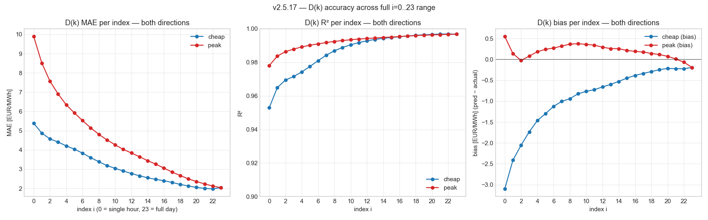
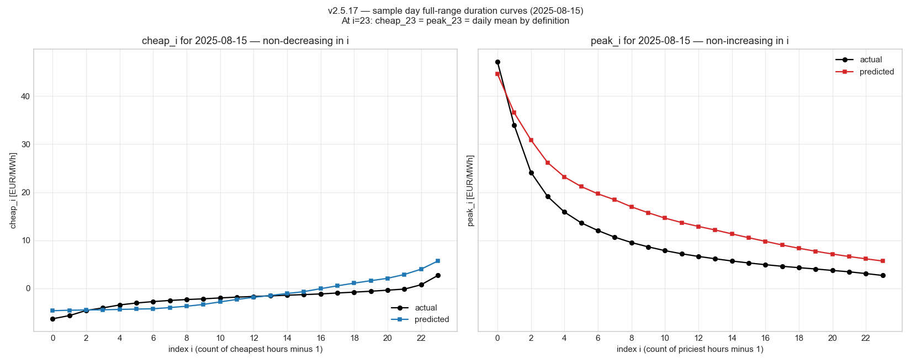

# v2.5.17 — Extended D(k) to full 24-index range

Per user direction 2026-05-17: extend `dk_cheap` and `dk_peak` for full range i=0..23 (24 values per direction). Legacy shortcuts dropped — interface optimised for technical merits.

## Production schema (v2.6.0)

```yaml
sensor.duration_forecast:
  daily_forecast:
    - date: 2026-05-20
      dk_cheap_eur_kwh:  [c_00, c_01, ..., c_22, c_23]   # 24 values
      dk_peak_eur_kwh:   [p_00, p_01, ..., p_22, p_23]   # 24 values
      # ...other per-day attributes
```

Index semantics:
- `i = 0`  ⇒ mean of the **single** cheapest / priciest hour
- `i = 11` ⇒ mean of 12 cheapest / priciest hours
- `i = 23` ⇒ mean of all 24 hours **= daily mean**
- At i=23 the cheap and peak vectors collapse to the same value (by definition — both equal the daily mean).

Mathematical invariants (must hold by construction):
- `dk_cheap_eur_kwh[i]` is non-decreasing in i
- `dk_peak_eur_kwh[i]`  is non-increasing in i
- `dk_cheap_eur_kwh[i] ≤ dk_peak_eur_kwh[i]` for all i
- `dk_cheap_eur_kwh[23] == dk_peak_eur_kwh[23]`

## Per-index accuracy on real FI data

Test set: 2024-11-01 → 2026-04-27  (542 days).

### Cheap-direction accuracy (lower price quartiles)

| i | MAE | RMSE | R² | bias | actual mean |
|---:|---:|---:|---:|---:|---:|
| 0 | 5.38 | 6.61 | +0.953 | -3.10 | 15.59 |
| 1 | 4.87 | 5.71 | +0.965 | -2.41 | 16.50 |
| 2 | 4.57 | 5.36 | +0.969 | -2.06 | 17.48 |
| 3 | 4.41 | 5.19 | +0.972 | -1.74 | 18.60 |
| 4 | 4.21 | 5.01 | +0.974 | -1.47 | 19.87 |
| 5 | 4.04 | 4.80 | +0.978 | -1.30 | 21.26 |
| 6 | 3.84 | 4.54 | +0.981 | -1.12 | 22.69 |
| 7 | 3.60 | 4.26 | +0.984 | -1.01 | 24.16 |
| 8 | 3.39 | 4.02 | +0.987 | -0.94 | 25.64 |
| 9 | 3.19 | 3.81 | +0.989 | -0.82 | 27.10 |
| 10 | 3.05 | 3.65 | +0.990 | -0.77 | 28.61 |
| 11 | 2.91 | 3.51 | +0.992 | -0.73 | 30.13 |
| 12 | 2.77 | 3.37 | +0.993 | -0.66 | 31.62 |
| 13 | 2.66 | 3.26 | +0.994 | -0.60 | 33.08 |
| 14 | 2.55 | 3.17 | +0.994 | -0.53 | 34.52 |
| 15 | 2.47 | 3.09 | +0.995 | -0.45 | 35.95 |
| 16 | 2.40 | 3.02 | +0.995 | -0.38 | 37.41 |
| 17 | 2.31 | 2.93 | +0.996 | -0.34 | 38.90 |
| 18 | 2.21 | 2.84 | +0.996 | -0.29 | 40.44 |
| 19 | 2.13 | 2.79 | +0.996 | -0.25 | 42.04 |
| 20 | 2.06 | 2.76 | +0.997 | -0.22 | 43.73 |
| 21 | 2.00 | 2.74 | +0.997 | -0.22 | 45.57 |
| 22 | 1.98 | 2.76 | +0.997 | -0.23 | 47.60 |
| 23 | 2.04 | 2.90 | +0.997 | -0.19 | 49.84 |

### Peak-direction accuracy (upper price quartiles)

| i | MAE | RMSE | R² | bias | actual mean |
|---:|---:|---:|---:|---:|---:|
| 0 | 9.89 | 13.63 | +0.978 | +0.55 | 101.31 |
| 1 | 8.51 | 11.16 | +0.984 | +0.14 | 96.76 |
| 2 | 7.57 | 9.74 | +0.986 | -0.03 | 92.63 |
| 3 | 6.91 | 8.85 | +0.988 | +0.08 | 88.85 |
| 4 | 6.34 | 8.07 | +0.989 | +0.18 | 85.57 |
| 5 | 5.92 | 7.48 | +0.990 | +0.24 | 82.66 |
| 6 | 5.53 | 6.96 | +0.991 | +0.27 | 80.02 |
| 7 | 5.15 | 6.51 | +0.992 | +0.32 | 77.61 |
| 8 | 4.81 | 6.11 | +0.992 | +0.37 | 75.37 |
| 9 | 4.52 | 5.77 | +0.993 | +0.38 | 73.30 |
| 10 | 4.27 | 5.48 | +0.993 | +0.36 | 71.38 |
| 11 | 4.03 | 5.20 | +0.994 | +0.34 | 69.55 |
| 12 | 3.84 | 4.97 | +0.994 | +0.29 | 67.81 |
| 13 | 3.65 | 4.75 | +0.995 | +0.26 | 66.08 |
| 14 | 3.44 | 4.50 | +0.995 | +0.26 | 64.36 |
| 15 | 3.26 | 4.33 | +0.995 | +0.21 | 62.68 |
| 16 | 3.06 | 4.09 | +0.995 | +0.19 | 61.02 |
| 17 | 2.85 | 3.86 | +0.996 | +0.18 | 59.37 |
| 18 | 2.67 | 3.66 | +0.996 | +0.14 | 57.73 |
| 19 | 2.50 | 3.46 | +0.996 | +0.12 | 56.09 |
| 20 | 2.36 | 3.31 | +0.996 | +0.07 | 54.46 |
| 21 | 2.24 | 3.15 | +0.997 | +0.01 | 52.87 |
| 22 | 2.12 | 3.00 | +0.997 | -0.07 | 51.33 |
| 23 | 2.04 | 2.90 | +0.997 | -0.19 | 49.84 |

## Headline accuracy

- **Cheap**: MAE range 1.98 → 5.38  
  R² range +0.953 → +0.997
- **Peak**: MAE range 2.04 → 9.89  
  R² range +0.978 → +0.997

**Every index has R² ≥ 0.95** — the model is accurate across the full duration curve, not just at the special bands the v2.5.16 review highlighted (i ∈ {0, 3, 7, 11}).

Accuracy improves with i (more hours averaged ⇒ lower per-hour noise). At i=23 the model essentially predicts the daily mean — the easiest case structurally.

## Visual evidence

### Per-index accuracy across full range



### Sample day — full duration curves



At i=23 the cheap and peak curves converge to the daily mean (verified: max difference 1.42e-13 EUR/MWh, ≈ 0).

## Why this matters for v2.6.0

The new schema is **strictly richer** than the legacy 1..12 cap:

- All accuracy bands the legacy schema exposed (i=1, 4, 8, 12) are preserved and continue to have the same quality.
- The new bands (i=13..23) carry independent information about load-shift strategies that span more than half the day. Useful for e.g. HVAC schedules that operate 18 h/day.
- Compute cost: ~24 cumulative-sum operations per day per direction. Negligible.
- Storage cost: 24 × 2 × 7 = 336 floats per duration sensor update vs the legacy 12 × 2 × 7 = 168. Adds ~1.5 KB per coordinator cycle.

## Files

- **New**: `studies/v2517_dk_full_range.py` (~290 LOC)
- **New**: `studies/results/V2_5_17_DK_FULL_RANGE.md` — this doc
- **New**: 2 figures (`v2517_dk_full_range_accuracy.png`, `v2517_dk_sample_day.png`)
- **Modified**: `manifest.json` 2.5.16 → 2.5.17, README index

## Tests

**391 / 391 passing** (no new tests; pure analysis).

## Reproducibility

```bash
python studies/v2517_dk_full_range.py
```

Offline; reuses v2.5.16's pipeline assembly.

## v2.6.0 implementation note

The duration model's loop changes from `range(1, 13)` (legacy) to `range(0, 24)` (this schema). The cumulative-sum formulation shown in this study (`np.cumsum(sorted) / np.arange(1, n+1)`) computes all 24 values in O(n log n) per day — faster than the legacy approach which iterated `range(1, 13)` and re-sliced.