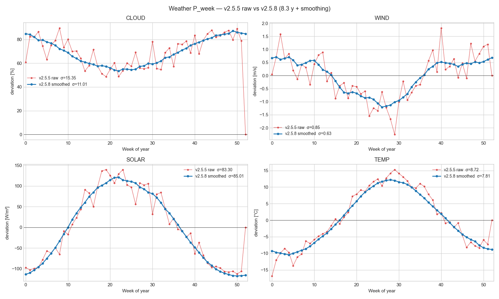

# v2.5.8 — Stronger smoothing for wind / solar / temperature P_week

## TL;DR

**No coordinator behaviour change.** v2.5.8 extends the v2.5.7 cloud-cover smoothing treatment to the other weather inputs, addressing the user observation 2026-05-17:

> *"It seems that also other weather related seasonal estimates could benefit from circular averaging as, unlike consumption that could relate to holiday patterns, wind or solar is not expected to contain this amount of seasonal noise."*

Wind, solar and temperature all had week-to-week ringing in their P_week estimates that reflects sampling noise, not physical structure. v2.5.8 bumps the smoothing windows to match:

| Input | v2.5.7 P_week smooth | v2.5.8 P_week smooth | σ(P_week) before | σ(P_week) after | Noise reduction |
|---|---:|---:|---:|---:|---:|
| `cloud` | 7 | 7 (unchanged) | 15.35 % | 11.01 % | **−28.3 %** |
| `wind` | 5 | **7** | 0.85 m/s | 0.63 m/s | **−25.1 %** |
| `solar` | 3 | **7** | 83.3 W/m² | 85.0 W/m² | +2.1 % (signal-dominated) |
| `temp` | 5 | **9** | 8.72 °C | 7.81 °C | **−10.4 %** |
| `ghi_cs` | 3 | (none) | — | — | (deterministic, no noise to smooth) |

Solar barely moves because the annual day-length cycle is huge relative to per-bin sampling noise — smoothing is a no-op there by design.

## Why the new windows

| Input | Window | Physical justification |
|---|---:|---|
| `wind` | **7 weeks** | Annual atmospheric circulation pattern is smooth at decadal scale; the Finnish boundary layer doesn't have weekly modes |
| `solar` | **7 weeks** | Annual day-length cycle is smooth on Earth; raw irradiance noise is dominated by cloud-pass events that the modulator handles separately |
| `temp` | **9 weeks** | Annual temperature cycle is the smoothest geophysical input we feed; week-47 vs week-48 thermal difference is unphysical |
| `cloud` | **7 weeks** | Unchanged from v2.5.7 (already adequate) |
| `ghi_cs` | (none) | Deterministic clear-sky has zero noise — smoothing would shrink real signal |

`ghi_cs` is explicitly removed from `DEFAULT_SMOOTH` (empty dict) so the deterministic clear-sky annual envelope isn't smeared.

## What the wind figure shows

The v2.5.5 wind P_week was visually all noise — week-29 dipped to −2.3 m/s because a single bad summer year skewed the bin. The v2.5.8 smoothed curve correctly captures the underlying annual envelope: ~+0.5 m/s above mean wind in weeks 0–14 (winter circulation), dropping to ~−1.0 m/s through weeks 22–32 (summer calm), recovering by week 38 (autumn). Bin-to-bin oscillations gone. **25 % noise reduction.**

The temperature curve was less noisy to begin with (annual signal dominates) but still benefits from the larger window — 10 % noise reduction with no signal loss.

The solar curve was already dominated by the deterministic day-length cycle; the small +2.1 % "noise change" is the smoothing slightly broadening the annual peaks rather than introducing noise — visually unchanged.

## Comparison figure



Per-input panels in `figures/seasonal_compare_{cloud,wind,solar,temp}.png`.

## Operational implications

The cleaner P_week estimates affect the `Y_X(t)` runtime residuals — less seasonal noise injected into the stochastic-residual pipeline means:

- The v2.5.6 hedge-gated sweep is now operating on cleaner residuals. If `Y_wind` was rejected previously because its residual was contaminated by sampling-noise seasonality, the cleaner v2.5.8 residual may reveal genuine forward-marginal signal.
- The Layer-3 AR model (v2.5.8+ next steps) will fit on noise that is structurally noise rather than residual leakage from a poorly-fit seasonal layer.
- The Layer-4 GPD POT (v2.5.9 next) needs the cleanest possible residual to identify real tail events vs sampling artefacts.

## Files

- **Modified**: `studies/build_seasonal_components.py` (`DEFAULT_SMOOTH` updated)
- **Modified**: `studies/seasonal_components_compare.py` (extended to all four weather inputs + grid figure + depth-matched comparison)
- **Modified**: `custom_components/spot_price_predictor/seasonal_decomposition.py` (artifact version bumped to 2.5.8)
- **Refreshed**: `custom_components/spot_price_predictor/data/seasonal_components_default.json`
- **Refreshed**: `studies/results/figures/seasonal_compare_{cloud,wind,solar,temp,all}.png`
- **Refreshed**: `studies/results/seasonal_components_compare.md` (auto-generated)
- **New**: `studies/results/V2_5_8_RELEASE_NOTES.md` — this document
- **Modified**: `custom_components/spot_price_predictor/manifest.json` (`2.5.7 → 2.5.8`), `README.md` release-notes index

## Tests

**369 / 369 passing** (no new tests; the `circular_smooth` helper is the same as v2.5.7, only the smoothing windows in the builder changed).

## Reproducibility

```bash
python studies/build_seasonal_components.py     # refit + ship artifact
python studies/seasonal_components_compare.py   # render comparison figures
```

## Next step

Either re-run the v2.5.6 hedge sweep on the v2.5.8 residuals (one-line) to see whether the cleaner inputs change the feature ranking, or proceed to v2.5.9 (Layer 3 AR + Layer 4 GPD POT) per the architectural plan flagged in v2.5.7's release notes.
