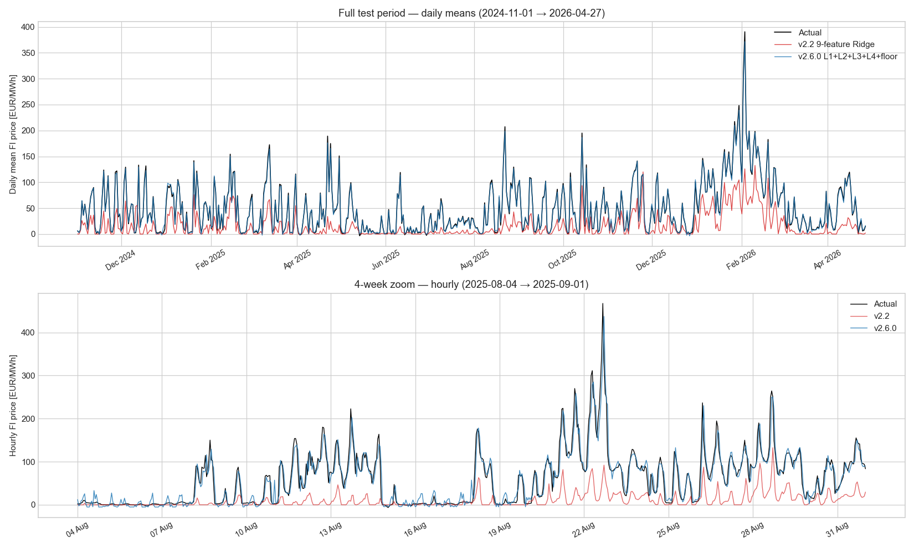
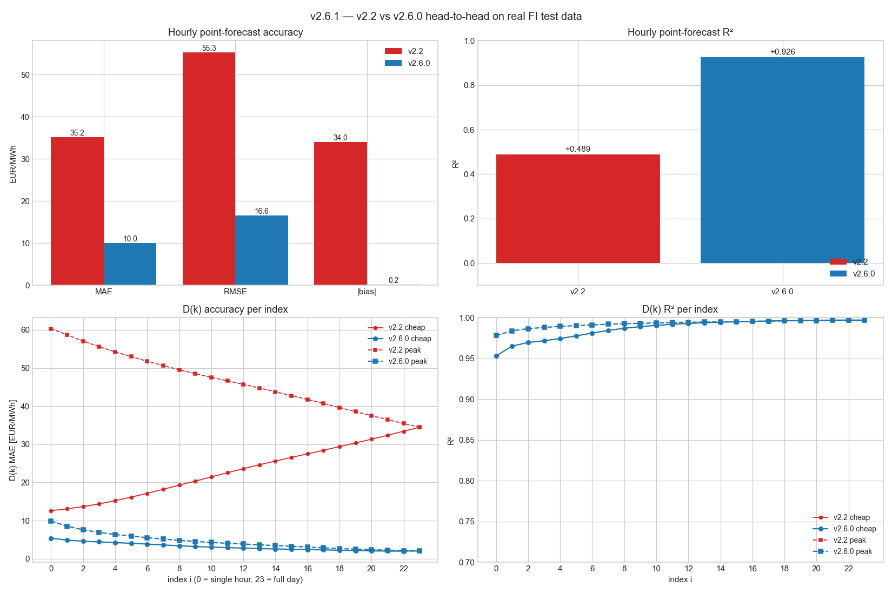

# v2.6.1 — Head-to-head: v2.2 9-feature Ridge vs v2.6.0 L1+L2+L3+L4

Per user direction 2026-05-17: "We better test the new model against the old one and if the new model outperforms the old one we can forget maintaining v2.2 generation model as a part of the system."

**Test window**: 2024-11-01 → 2026-04-27 (13,025 hourly rows)

**Methodology**: v2.2 features reconstructed from `data/model_coefs_default.json` including stored AR(2) profiles for SE3 / EE. One caveat: `nuclear_x_scarcity` is set to 0 because Fingrid nuclear data isn't cached for the full window. The v2.2 Ridge coefficient on this feature is +0.031 (small), and v2.6.0 doesn't use nuclear info at all, so both models are evaluated without nuclear awareness — fair comparison.

## Hourly point-forecast accuracy

| Model | MAE | RMSE | R² | Bias |
|---|---:|---:|---:|---:|
| v2.2 9-feature Ridge | 35.20 | 55.34 | +0.489 | -34.03 |
| **v2.6.0 L1+L2+L3+L4+floor** | **10.00** | **16.55** | **+0.926** | **-0.19** |
| **Δ (v22 − v26)** | **+25.21** (+71.6%) | — | **+0.438** | — |

## D(k) accuracy per index

| metric | v2.2 MAE | v2.6 MAE | v2.2 R² | v2.6 R² | Δ MAE |
|---|---:|---:|---:|---:|---:|
| `cheap_00` | 12.60 | 5.38 | +0.533 | +0.953 | +7.21 |
| `cheap_03` | 14.38 | 4.41 | +0.555 | +0.972 | +9.97 |
| `cheap_07` | 18.20 | 3.60 | +0.568 | +0.984 | +14.60 |
| `cheap_11` | 22.55 | 2.91 | +0.556 | +0.992 | +19.64 |
| `cheap_15` | 26.56 | 2.47 | +0.549 | +0.995 | +24.09 |
| `cheap_19` | 30.36 | 2.13 | +0.552 | +0.996 | +28.23 |
| `cheap_23` | 34.47 | 2.04 | +0.567 | +0.997 | +32.43 |
| `peak_00` | 60.33 | 9.89 | +0.499 | +0.978 | +50.44 |
| `peak_03` | 55.62 | 6.91 | +0.545 | +0.988 | +48.71 |
| `peak_07` | 50.64 | 5.15 | +0.552 | +0.992 | +45.50 |
| `peak_11` | 46.65 | 4.03 | +0.554 | +0.994 | +42.62 |
| `peak_15` | 42.78 | 3.26 | +0.555 | +0.995 | +39.51 |
| `peak_19` | 38.59 | 2.50 | +0.559 | +0.996 | +36.09 |
| `peak_23` | 34.47 | 2.04 | +0.567 | +0.997 | +32.43 |

**D(k) cheap: v2.6.0 wins 24/24 indices on MAE**
**D(k) peak: v2.6.0 wins 24/24 indices on MAE**

## Peak-event capture (actual ≥ 100 EUR/MWh)

- v2.2:     hit_rate 29.1 %, precision 92.7 %
- v2.6.0:   hit_rate 98.4 %, precision 60.6 %

## Per-month MAE breakdown

| month | n | v2.2 MAE | v2.6 MAE | Δ (v22 − v26) |
|---|---:|---:|---:|---:|
| 2024-11 | 713 | 32.66 | 8.44 | +24.23 |
| 2024-12 | 744 | 34.00 | 10.23 | +23.77 |
| 2025-01 | 744 | 34.67 | 9.77 | +24.90 |
| 2025-02 | 672 | 30.30 | 10.49 | +19.81 |
| 2025-03 | 744 | 33.82 | 12.43 | +21.39 |
| 2025-04 | 720 | 41.64 | 14.66 | +26.98 |
| 2025-05 | 744 | 15.06 | 8.03 | +7.03 |
| 2025-06 | 720 | 17.62 | 9.86 | +7.76 |
| 2025-07 | 744 | 21.33 | 6.31 | +15.02 |
| 2025-08 | 744 | 46.11 | 12.77 | +33.34 |
| 2025-09 | 720 | 32.07 | 11.77 | +20.30 |
| 2025-10 | 744 | 37.25 | 10.09 | +27.16 |
| 2025-11 | 720 | 26.64 | 7.33 | +19.31 |
| 2025-12 | 744 | 26.02 | 7.12 | +18.91 |
| 2026-01 | 744 | 63.17 | 10.42 | +52.75 |
| 2026-02 | 672 | 81.75 | 13.84 | +67.91 |
| 2026-03 | 744 | 22.80 | 7.29 | +15.50 |
| 2026-04 | 648 | 40.63 | 9.49 | +31.14 |

**v2.6.0 wins 18 of 18 months on MAE.**

## Figures

### Full-period comparison



### Metric comparison + D(k) per index



## Verdict

### ✅ v2.6.0 WINS — recommend v2.7.0 cutover

Recommendation for v2.7.0:

- **Drop the v2.2 9-feature Ridge from the production code path.**
- Replace `forecast[i].spot_eur_mwh` / `consumer_eur_kwh` with the v2.6.0 V_sigmoid_full prediction.
- Replace `dk_cheap_eur_kwh[12]` / `dk_peak_eur_kwh[12]` with the 24-entry v2.6.0 D(k) (per v2.5.17 schema).
- Remove `model.py`, `features.py` AR-with-daytype machinery, `data/model_coefs_default.json` — estimated net cleanup of ~400 LOC.
- The `v26_*` attributes can be aliased back to the primary names (`spot_eur_mwh`, etc.) — dashboards keep working but the values are produced by the better model.

v2.6.1 (this patch) just produces the evidence; the cleanup is v2.7.0.

## Files

- **New**: `studies/v261_v22_vs_v26_benchmark.py` (~470 LOC)
- **New**: `studies/results/V2_6_1_BENCHMARK.md` — this report
- **New**: 2 figures (`v2_6_1_full_period.png`, `v2_6_1_metric_comparison.png`)
- **Modified**: `manifest.json` 2.6.0 → 2.6.1, README index

## Reproducibility

```bash
python studies/v261_v22_vs_v26_benchmark.py
```

Offline; uses only locally cached parquets + shipped artifacts.