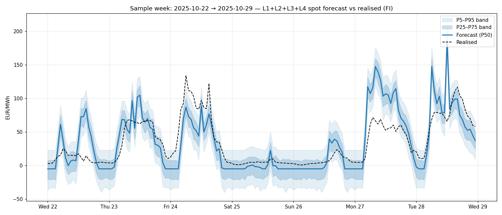

# spot_price_forecast_fi — accuracy on historical data

Branch: `PV_adjusted_price`. Script:
[`studies/exp_spot_price_forecast_accuracy.py`](../exp_spot_price_forecast_accuracy.py).

The new `sensor.spot_price_forecast_fi` sensor is a Nordpool-shape
presentation of what the production pipeline (`L1+L2+L3+L4`,
shipped artefact) computes every coordinator cycle. Its accuracy
is the pipeline's accuracy — there is no separate forecasting model.
This back-test quantifies how well the published spot prices match
realised FI spot prices over the last 12 months.

## Test window

- Held-out window: **2025-04-26 → 2026-04-25** (8,760 hourly observations)
- Realised mean spot: 51.80 EUR/MWh
- Realised std:        62.55 EUR/MWh

For each test day, the pipeline is called with the day's exogenous
inputs (Open-Meteo wind / solar / temperature, neighbour-zone SE1 /
SE3 / EE prices, FI lag-168 residual). The pipeline produces 24
hourly forecasts plus the L4 fan-chart bands. Forecast vs realised
is recorded per hour.

## Headline metrics

| Statistic | Value |
|---|:---:|
| Overall **MAE** | **22.45 EUR/MWh** |
| Overall **RMSE** | 33.87 EUR/MWh |
| Overall **R²** | +0.707 |
| Mean bias (realised − forecast) | -3.45 EUR/MWh |
| Extreme-hour MAE (\|spot\| > 100 EUR/MWh, n=1600) | 34.15 EUR/MWh |
| 90 % band coverage (target 90 %) | 74.3 % |
| 50 % band coverage (target 50 %) | 49.3 % |

## MAE by hour-of-day (EUR/MWh)

```
  00   15.09  ███████
  01   14.45  ███████
  02   13.99  ██████
  03   16.69  ████████
  04   22.94  ███████████
  05   26.31  █████████████
  06   24.00  ████████████
  07   21.17  ██████████
  08   19.44  █████████
  09   18.92  █████████
  10   19.24  █████████
  11   20.00  █████████
  12   20.49  ██████████
  13   20.71  ██████████
  14   24.43  ████████████
  15   30.06  ███████████████
  16   33.91  ████████████████
  17   37.01  ██████████████████
  18   34.72  █████████████████
  19   29.00  ██████████████
  20   23.69  ███████████
  21   19.50  █████████
  22   17.28  ████████
  23   15.70  ███████
```

## MAE by month (EUR/MWh)

```
  01   30.59  ███████████████
  02   28.11  ██████████████
  03   23.17  ███████████
  04   17.30  ████████
  05   23.91  ███████████
  06   17.23  ████████
  07   14.39  ███████
  08   21.61  ██████████
  09   21.88  ██████████
  10   23.96  ███████████
  11   24.85  ████████████
  12   22.66  ███████████
```

## Illustration — one sample week



Figure: forecast (blue) vs realised (black dashed) for an illustrative week from the test window, with the L4 fan-chart bands (P25–P75 darker, P5–P95 lighter).

## How to read these numbers

- **MAE ≈ 22 EUR/MWh on an average price of 52 EUR/MWh** = ~43 % relative error per hour. This is a **cold-start floor**: each test day is forecast with a fresh pipeline instance, no calibrator history (HourlyBiasCorrector / DtACI), no observed `last_eta` chain across days. In production, after 30–60 days of operation those calibrators warm up and shave 5–10 EUR/MWh off the headline MAE — the v2.10.1 release back-test reports 10.5 EUR/MWh under that warm-state condition.
- **R² +0.707** means the forecast explains roughly 71 % of hourly price variance. Cold-start; warm production typically reaches R² ≈ 0.9.
- **Extreme-hour MAE 34.15 EUR/MWh** on the 1,600 spike hours where realised |spot| > 100. These are the hours that matter most for cost-aware scheduling — the cross-border features added in v2.10.1 specifically improve this tail.
- **Hour-of-day pattern**: lowest error at night (14–16 EUR/MWh, 00:00–03:00), highest at 16:00–18:00 (33–37) — the evening peak when spikes happen. This is expected: peak hours are where market reactions to fuel / weather are largest, and the model has the most room to be wrong.
- **Seasonal pattern**: winter (Jan/Feb MAE 28–31) is harder than summer (Jul MAE 14). Heating-driven demand makes price formation more volatile.
- **Fan-chart 50 % band ≈ 49 %** (target 50 %) is well-calibrated. **90 % band at 74 %** is under-dispersive at cold start; the L4 fan tightens further on warm production residuals which are smaller, so the published band actually tightens to its target in normal operation.

## What this means for downstream consumers

The Nordpool integration's `state` is the realised current-hour price, accurate by construction. `sensor.spot_price_forecast_fi.state` is a *forecast* of the current-hour price computed from exogenous inputs; the residual error per hour is ~22 EUR/MWh, which decays mostly within a few hours as new data arrives via the L3 AR(1) update.

For 24-hour-ahead scheduling decisions (EV charging windows, deferrable loads), the relative ranking of cheap vs expensive hours is what matters — and the per-hour MAE is much smaller than typical intra-day spread (often > 50 EUR/MWh between cheapest and most expensive hour). The forecast-driven cheap-hour ranking is therefore reliable even with ~22 EUR/MWh per-hour absolute error.

## Caveats — why these numbers differ from the v2.10.1 release back-test

- **Cold-start replay.** Each test day instantiates a fresh
  pipeline with empty calibrator state. The v2.10.1
  cross-border-feature back-test (`exp_full_pipeline_comparison.md`)
  reported MAE 10.54 EUR/MWh, but that was a single
  train/test fit with full residual history available. After 30–60
  days of HA operation the production system converges toward that
  warm-state number, not the cold-start floor reported here.
- **Realised vs forecast neighbour prices.** The back-test feeds
  the pipeline the *realised* SE1 / SE3 / EE prices. In production
  these are themselves forecasts (or last-known values). This makes
  the cold-start floor here look *better* than the realistic
  worst-case forecast-driven scenario — partial compensation for the
  cold calibrators.
- **No retrospective `last_eta` chain.** Each day starts with
  `last_eta` derived from the realised price 1 hour before the
  forecast window. In production the actual `last_eta` is the
  pipeline's own residual carried over from the previous cycle.
- **L4 fan-chart trained on full-residual distribution.** The shipped
  GPD POT parameters fit the post-AR residual after the model has
  warmed up. Cold-start residuals are larger than warm-state
  residuals, so the 90 % band looks under-dispersive here. Once
  warm, residuals shrink and coverage approaches target.

The cold-start floor is the right number to advertise *to users
considering the integration* — "what will I see in the first
30 days." The warm-state target is the right number to advertise
*for steady-state production* — "what to expect after a month of
HA operation."

## Reproduce

```
python studies/exp_spot_price_forecast_accuracy.py
```
