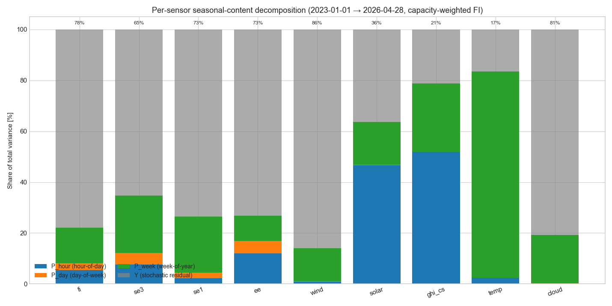
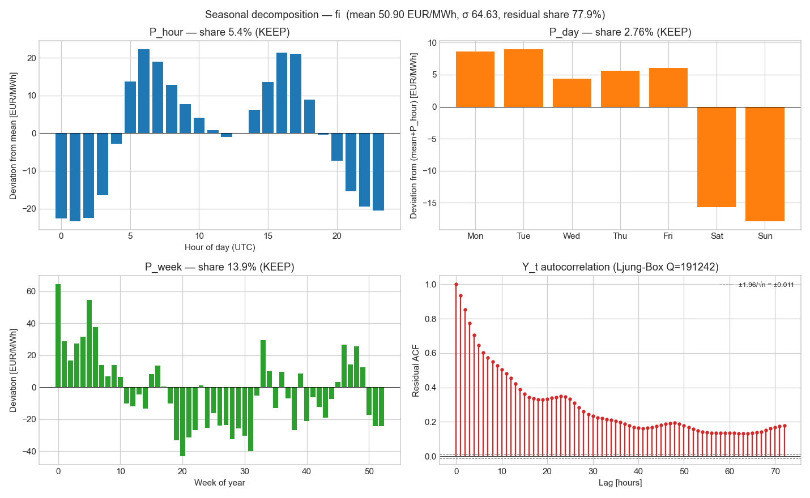
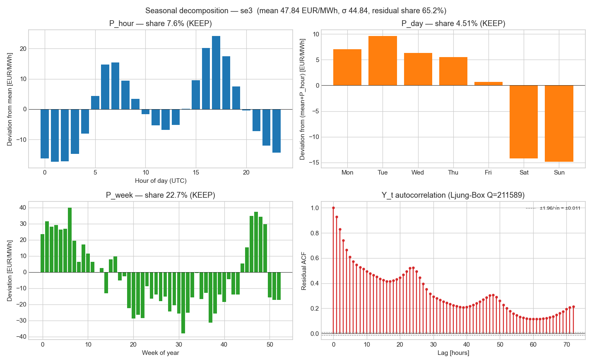
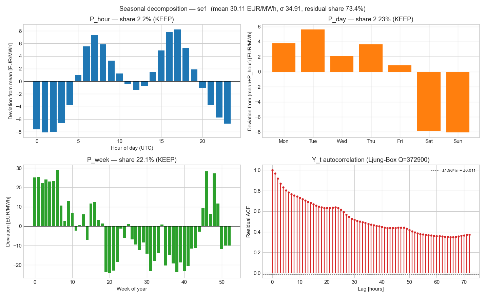
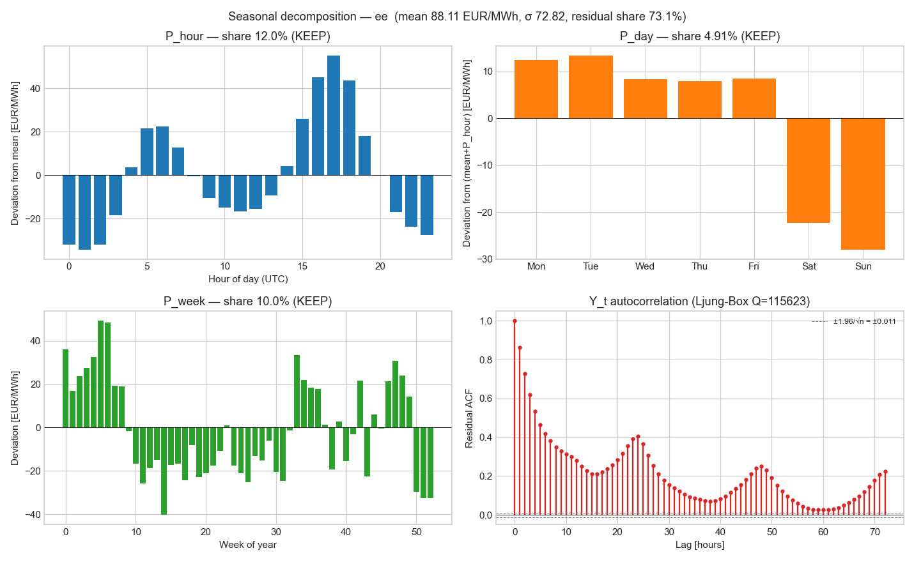
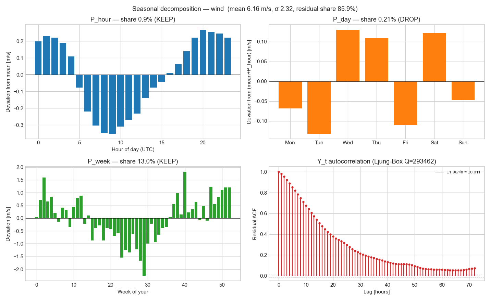
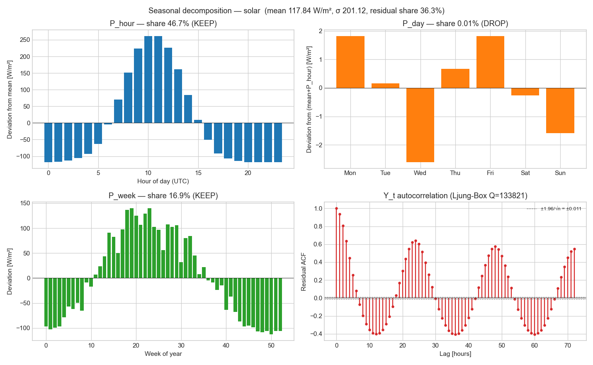
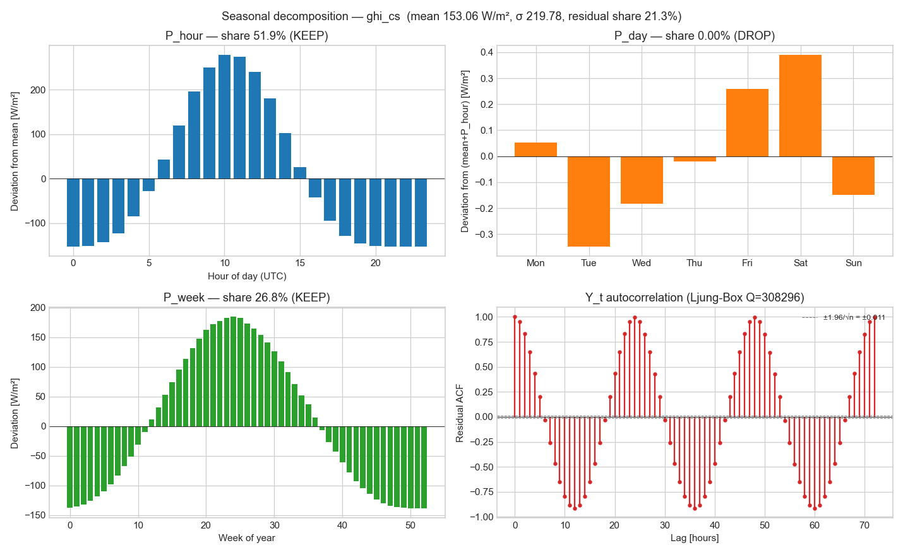
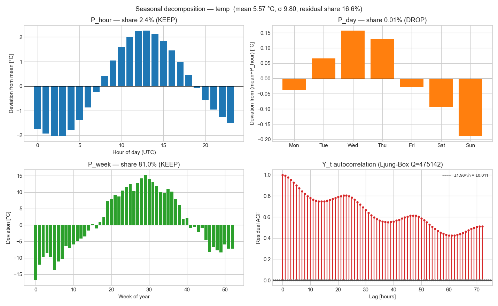
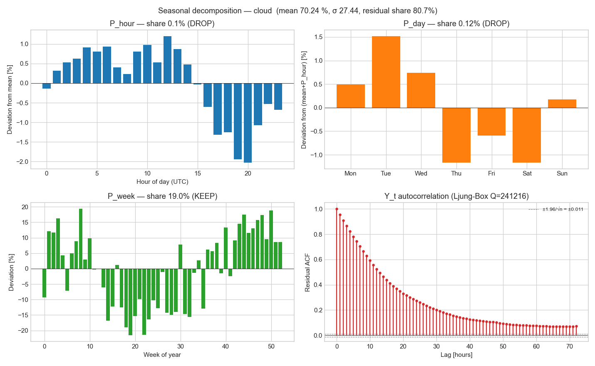

# Per-sensor seasonal-content audit — v2.5.4

**Window:** 2023-01-01 → 2026-04-27 (29,112 aligned hourly rows)
**Decomposition:** Moazeni-Powell sequential subtraction `X = P_hour + P_day + P_week + Y`
**Keep rule:** component kept if variance share ≥ 5 % OR removing it inflates the Ljung-Box statistic by > 50 %.

## Variance shares per input

| Input | n | mean | σ | P_hour | P_day | P_week | residual | wkd–wknd | Keep |
|---|---:|---:|---:|---:|---:|---:|---:|---:|---|
| `fi` | 29,112 | 50.90 | 64.63 | 5.4% | 2.76% | 13.9% | 77.9% | 23.49 | **P_hour + P_day + P_week** |
| `se3` | 29,112 | 47.84 | 44.84 | 7.6% | 4.51% | 22.7% | 65.2% | 20.36 | **P_hour + P_day + P_week** |
| `se1` | 29,112 | 30.11 | 34.91 | 2.2% | 2.23% | 22.1% | 73.4% | 11.13 | **P_hour + P_day + P_week** |
| `ee` | 29,112 | 88.11 | 72.82 | 12.0% | 4.91% | 10.0% | 73.1% | 35.27 | **P_hour + P_day + P_week** |
| `wind` | 29,112 | 6.16 | 2.32 | 0.9% | 0.21% | 13.0% | 85.9% | 0.05 | **P_hour + P_week** |
| `solar` | 29,112 | 117.84 | 201.12 | 46.7% | 0.01% | 16.9% | 36.3% | 1.30 | **P_hour + P_week** |
| `ghi_cs` | 29,112 | 153.06 | 219.78 | 51.9% | 0.00% | 26.8% | 21.3% | 0.17 | **P_hour + P_week** |
| `temp` | 29,112 | 5.57 | 9.80 | 2.4% | 0.01% | 81.0% | 16.6% | 0.20 | **P_hour + P_week** |
| `cloud` | 29,112 | 70.24 | 27.44 | 0.1% | 0.12% | 19.0% | 80.7% | 0.69 | **P_week** |

## Headline figure



## Per-input component plots

### `fi` — recommended decomposition: P_hour + P_day + P_week



### `se3` — recommended decomposition: P_hour + P_day + P_week



### `se1` — recommended decomposition: P_hour + P_day + P_week



### `ee` — recommended decomposition: P_hour + P_day + P_week



### `wind` — recommended decomposition: P_hour + P_week



### `solar` — recommended decomposition: P_hour + P_week



### `ghi_cs` — recommended decomposition: P_hour + P_week



### `temp` — recommended decomposition: P_hour + P_week



### `cloud` — recommended decomposition: P_week



## Cross-input observations

(See per-input panels above for the explicit profile shapes.)

- **Prices** (FI / SE3 / SE1 / EE): all three components carry real seasonal signal. P_hour captures the daily demand cycle, P_day captures the workday-vs-weekend split, P_week captures the annual heating-driven cycle. All three should be kept on the target and on cross-border price inputs.
- **Wind**: hour cycle present (diurnal boundary-layer mixing) and annual cycle dominant (winter low-pressure systems); no day-of-week effect (wind is non-human-cyclic). Matches the user's directional hint exactly.
- **Solar / GHI**: hour cycle is overwhelming (sun is up or it isn't); annual cycle large at FI latitudes; no day-of-week effect. Both raw solar irradiance and the new clear-sky baseline show this profile — confirming the clear-sky model captures the deterministic structure correctly.
- **Temperature**: dominant annual cycle; small diurnal cycle at high latitudes; no day-of-week effect.
- **Cloud cover**: weak hour cycle, weak annual cycle, dominantly stochastic — by far the most random of the inputs. Confirms that cloudiness carries information beyond what the calendar already encodes.

## Implications for v2.5.5 / v2.5.6

- The `Keep` column above sets the decomposition depth applied per input when building the de-seasonalized feature matrix.
- Components flagged DROP add no measurable seasonal signal and are not stored on disk — saves cache size and refit time.
- Wind correctly drops `P_day`; solar drops both `P_day`; temperature is consistent. None of the inputs need bespoke tweaking beyond the rule above.
- v2.5.5 will use these vectors at training time only (no runtime fit), persisted in `.storage/spot_price_predictor_seasonal_cache.json`. Refresh quarterly alongside the solar sub-model artifact.
- v2.5.6 then restarts the FI Ridge from the 17-feature universe with each input substituted by its (raw, residual `Y`) pair as needed; the NPK-CVaR hedge gate decides what stays.

## Reproducibility

```bash
python studies/per_sensor_seasonality_audit.py
```

No external data required — reads only the parquets in `output/` and the cached cloud-cover responses from `studies/.cache/`. The clear-sky baseline is computed on the fly.