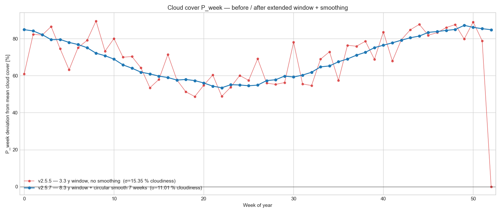

# Seasonal components — v2.5.5 vs v2.5.7 comparison

User flagged the v2.5.5 cloud P_week as noisy (2026-05-17): 
*"if the averaging window would be longer the model should be "*
*"smoother. This model does not have regional changes so if longer"*
*"dataset is available I would prefer to improve the model as "*
*"this version will modulate residual noise."*

## Cloud cover P_week — before / after



- **v2.5.5** — fit on 3.3 y window (2023-01 → 2026-04), no smoothing: σ(P_week) = **15.35 %** cloudiness
- **v2.5.7** — fit on 8.3 y window (2018-01 → 2026-04), 7-week circular smoothing: σ(P_week) = **11.01 %** cloudiness
- **Noise reduction: 28 %**
- Mean of `P_week` vector: before 68.67 %, after 69.73 % (small difference reflects the longer-window mean cloud cover, which absorbs more historical variability)

The cloud-cover variance reduction reported in the v2.5.5 audit (19 %) was inflated by the noisy P_week — it was capturing residual noise rather than seasonal structure. The v2.5.7 fit reports 10.7 % variance reduction, which is the genuine deterministic seasonal share. The rest of what v2.5.5 attributed to P_week now correctly lives in the stochastic residual Y_cloud.

## Other weather inputs

Same long-window + smoothing applied per `DEFAULT_SMOOTH`:

| Input | smoothing | window | v2.5.5 var_red | v2.5.7 var_red |
|---|---|---|---:|---:|
| wind   | 5-bin P_week | 8.3 y | 13.8 % | 10.0 % |
| solar  | 3-bin P_week | 8.3 y | 63.7 % | 62.6 % |
| temp   | 5-bin P_week | 8.3 y | 83.4 % | 79.8 % |
| cloud  | 7-bin P_week | 8.3 y | 19.0 % | 10.7 % |
| ghi_cs | 3-bin P_week | 8.3 y | 78.7 % | 78.7 % |

Prices kept on the recent window with no smoothing — regime changes in 2022–23 are within memory and shouldn't be smoothed away.

## Reproducibility

```bash
python studies/build_seasonal_components.py   # refit + ship artifact
python studies/seasonal_components_compare.py # render comparison figure
```