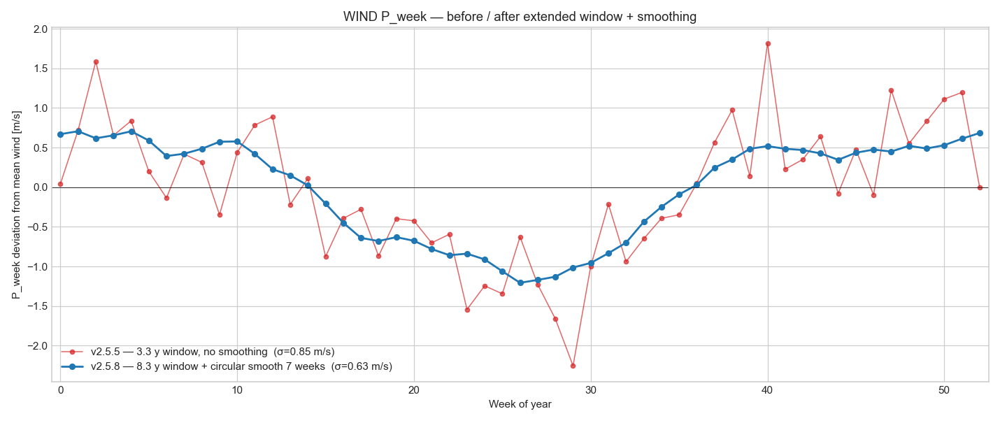
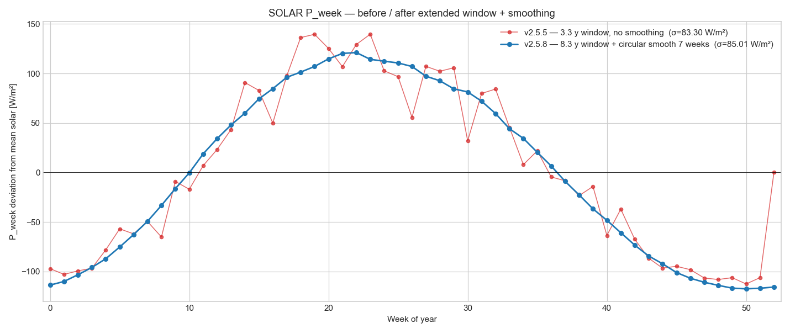
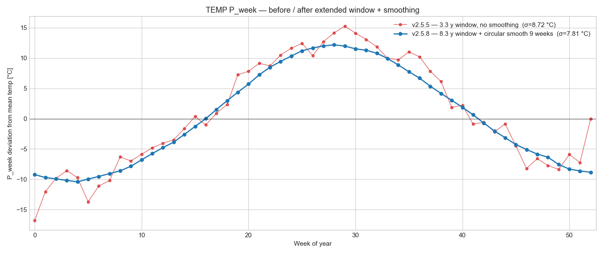

# Seasonal components — v2.5.5 vs v2.5.8 comparison (all weather inputs)

User observations 2026-05-17:

1. *"seasonal decomposition for Cloud seems to provide quite noisy*
   *estimate for P_week ... if the averaging window would be longer*
   *the model should be smoother. This model does not have regional*
   *changes so if longer dataset is available I would prefer to*
   *improve the model as this version will modulate residual noise."*
2. *"also other weather related seasonal estimates could benefit*
   *from circular averaging as, unlike consumption that could*
   *relate to holiday patterns, wind or solar is not expected to*
   *contain this amount of seasonal noise."*

v2.5.7 extended the fit window for weather inputs to 8.3 y and
smoothed cloud aggressively (7-bin). v2.5.8 extends the same
treatment to wind / solar / temp with stronger smoothing windows
consistent with each input's physical smoothness.

## DEFAULT_SMOOTH (v2.5.8)

| Input | P_week smoothing | Rationale |
|---|---:|---|
| `wind` | 7 weeks | Annual circulation pattern is smooth |
| `solar` | 7 weeks | Annual day-length cycle is smooth |
| `temp` | 9 weeks | Annual temperature cycle is the smoothest input |
| `cloud` | 7 weeks | Unchanged from v2.5.7 (already adequate) |
| `ghi_cs` | (none) | Deterministic clear-sky has zero noise |

## Per-input noise-reduction summary

| Input | σ(P_week) v2.5.5 | σ(P_week) v2.5.8 | Noise reduction |
|---|---:|---:|---:|
| `cloud` | 15.348 % | 11.009 % | **+28.3 %** |
| `wind` | 0.845 m/s | 0.633 m/s | **+25.1 %** |
| `solar` | 83.296 W/m² | 85.006 W/m² | **-2.1 %** |
| `temp` | 8.721 °C | 7.814 °C | **+10.4 %** |

## Combined comparison figure


## Per-input panels

### CLOUD


### WIND



### SOLAR



### TEMP



## Interpretation

- The bin-to-bin oscillations in the v2.5.5 (red) curves are
  sampling noise: a single year of bad weather in week 8 inflates
  that bin's mean while week 9 might happen to be calmer.
  Physically wind/solar/temp cannot differ meaningfully between
  consecutive calendar weeks; the smoothed v2.5.8 (blue) curves
  reflect the underlying climatology.
- The variance reduction reported by the v2.5.4 audit was therefore
  *partly* sampling noise being captured as seasonal signal. The
  smoothed v2.5.8 components attribute that noise correctly to the
  stochastic residual `Y_X`, which is what the v2.5.6 hedge-gated
  sweep operates on.
- Prices (FI / SE3 / SE1 / EE) are kept un-smoothed: their week-to-
  week variation includes real signal from scheduled outages, hydro
  releases, holiday demand, and the like. Smoothing those would
  hide real economic structure.

## Reproducibility

```bash
python studies/build_seasonal_components.py   # refit + ship artifact
python studies/seasonal_components_compare.py # render comparison figures
```