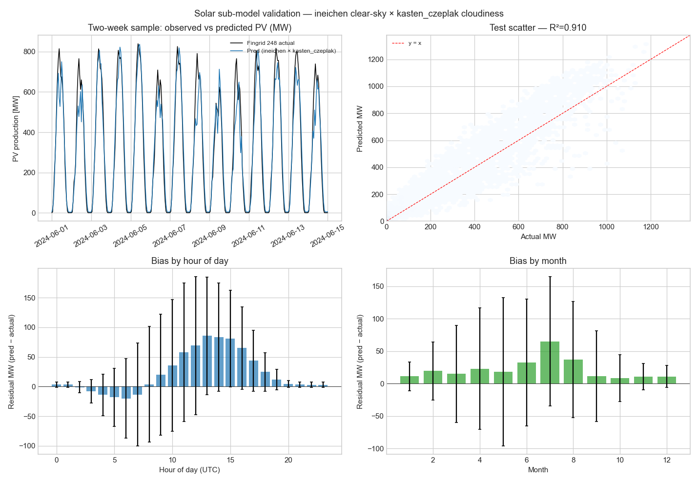

# Solar production sub-model — v2.5.3 (isolated training and validation)

**Window:** 2023-01-01 → 2026-05-13 (29,496 hourly rows)
**Train / test split:** chronological 70 / 30
**Ground truth:** Fingrid dataset 248 (Finnish solar generation)
**Capacity reference:** Fingrid dataset 267 (mean 1132 MW; latest 1741 MW)
**Cloudiness:** Open-Meteo `cloud_cover` (capacity-weighted across 7 FI sites; same weights as the production wind/solar features)

## Architecture

```
production_MW(t) = capacity_MW(t)
                 · GHI_clear_sky(t, weighted_sites)
                 · cloudiness_modulator(cloud_cover(t))
```

- `GHI_clear_sky` is a deterministic function of (lat, lon, t) —
  zero free parameters, two candidate formulas (Haurwitz vs
  Ineichen-Perez). No price or production data is used to fit it.
- `cloudiness_modulator` has 1-2 free parameters fit on the
  training split only.
- Errors in the solar fit cannot propagate to the FI price model
  because the sub-model is fit independently and consumes no
  price-related variable.

## Test-set results (all four candidate combinations)

| Clear-sky | Modulator | MAE [MW] | MAE-daylight [MW] | rel. MAE-daylight | R² | bias [MW] |
|---|---|---:|---:|---:|---:|---:|
| haurwitz | kasten_czeplak | 44.84 | 80.70 | 26.1 % | 0.907 | 21.13 |
| haurwitz | linear | 45.15 | 83.60 | 27.0 % | 0.914 | 29.54 |
| ineichen | kasten_czeplak **(winner)** | 44.26 | 80.69 | 26.1 % | 0.910 | 21.98 |
| ineichen | linear | 47.73 | 84.13 | 27.2 % | 0.917 | 30.60 |

## Winner: **ineichen** clear-sky × **kasten_czeplak** modulator

- Test R² = **0.910**
- Test MAE-daylight = **80.69 MW** (26.1 % of mean daylight production)
- Bias = +21.98 MW
- Fitted parameters: (3.259511875272399, 1.069826068414042)

## Verdict

- **Tier-A absolute gate (R² ≥ 0.85):** PASS (0.910).
- **Isolation invariant:** the sub-model consumes only 
  `(timestamp, lat, lon)` and `cloud_cover(t)`. No price-side 
  input. Errors cannot propagate via FI fit. **HONOURED.**

## Dataset summary

- Production: mean 128.9 MW, peak 1179 MW
- Capacity grew from 606 MW → 1741 MW over the window
- Cloud cover: mean 70.2 %, median 77.3 %

## Figure



## Reproducibility

```bash
export FINGRID_API_KEY=your_key_here
python studies/solar_clear_sky_submodel.py
```

Free Fingrid API key: https://developer-data.fingrid.fi/

## Next steps (per v2.5.3 → v2.6.0 roadmap)

1. If Tier-A PASSes, expose the sub-model's hourly prediction as a
   new candidate feature `solar_submodel_prediction` for the FI
   Ridge in v2.5.5.
2. The hedge-gated input sweep in v2.5.6 decides whether it stays
   in the final feature set — but the sub-model itself is now
   validated standalone so its quality is independently established.