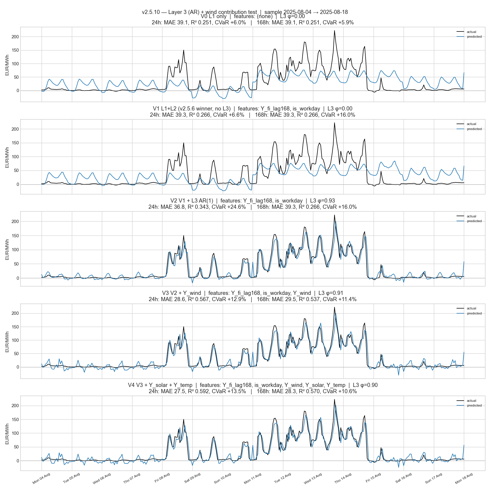
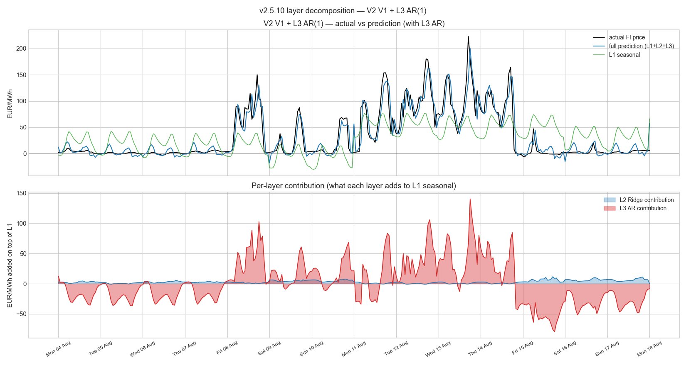

# v2.5.10 — Layer 3 (AR on Ridge residual) + wind contribution

**Window:** 2023-01-08 → 2026-04-27 (28,944 hourly rows)
**Split:** chronological 55 / 45
**Layer 3:** AR(1) on Layer-2 Ridge residual `ε(t) = φ · ε(t-1) + η(t)`

User question 2026-05-17: does adding `Y_wind` to the Ridge layer (with Layer 3 in place) improve the FI prediction?

## Variant comparison (per-horizon, properly evaluated)

MAE / R² / CVaR-reduction reported separately at each horizon.
The AR(1) contribution at horizon h decays as φ^h, so its boost
shrinks at long lead times.

| Variant | L3 | φ | h=24h MAE / R² / CVaR | h=48h MAE / R² / CVaR | h=168h MAE / R² / CVaR |
|---|:-:|---:|---|---|---|
| V0 L1 only | · | +0.00 | 39.09 / +0.251 / +6.0% | 39.09 / +0.251 / +5.7% | 39.09 / +0.251 / +5.9% |
| V1 L1+L2 (v2.5.6 winner, no L3) | · | +0.00 | 39.32 / +0.266 / +6.6% | 39.32 / +0.266 / +6.4% | 39.32 / +0.266 / +16.0% |
| V2 V1 + L3 AR(1) | ✓ | +0.93 | 36.77 / +0.343 / +24.6% | 39.05 / +0.274 / +8.7% | 39.32 / +0.266 / +16.0% |
| V3 V2 + Y_wind | ✓ | +0.91 | 28.55 / +0.567 / +12.9% | 29.46 / +0.539 / +4.9% | 29.54 / +0.537 / +11.4% |
| V4 V3 + Y_solar + Y_temp | ✓ | +0.90 | 27.55 / +0.592 / +13.5% | 28.28 / +0.572 / +5.5% | 28.33 / +0.570 / +10.6% |

## Variant overlay



## Winning variant (V2 V1 + L3 AR(1)) — layer decomposition



## Reproducibility

```bash
python studies/v2510_layer3_ar_wind.py
```