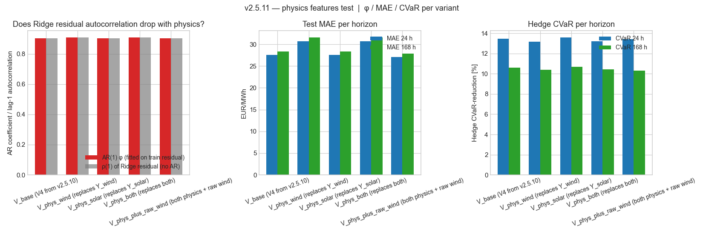
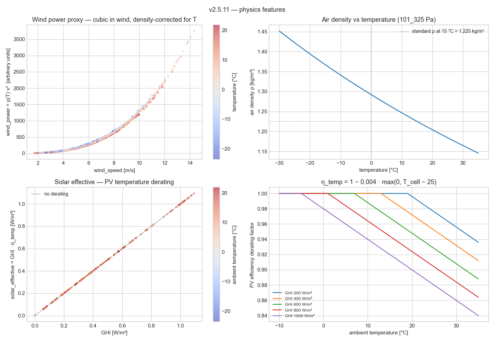

# v2.5.11 — Physics-based wind and solar features

**Window:** 2023-01-08 → 2026-04-27 (28,944 hourly rows)

Physics:
- `wind_power = ρ_air(T) · v³` (kinetic flux per swept area, T in K via Boyle's law)
- `solar_effective = GHI · η_temp(T_cell)` with `T_cell ≈ T_ambient + 0.03·GHI` (NOCT) and `η_temp = 1 − 0.004·max(0, T_cell − 25)` (Si PV temperature coefficient)

## Variant comparison

| Variant | φ | ρ(1) | h=24 MAE/R²/CVaR | h=168 MAE/R²/CVaR |
|---|---:|---:|---|---|
| V_base (V4 from v2.5.10) | +0.903 | +0.903 | 27.55 / +0.592 / +13.5% | 28.33 / +0.570 / +10.6% |
| V_phys_wind (replaces Y_wind) | +0.908 | +0.908 | 30.64 / +0.501 / +13.2% | 31.54 / +0.475 / +10.4% |
| V_phys_solar (replaces Y_solar) | +0.903 | +0.903 | 27.56 / +0.592 / +13.6% | 28.34 / +0.570 / +10.7% |
| V_phys_both (replaces both) | +0.908 | +0.908 | 30.66 / +0.501 / +13.2% | 31.55 / +0.475 / +10.4% |
| V_phys_plus_raw_wind (both physics + raw wind) | +0.903 | +0.902 | 27.06 / +0.604 / +13.4% | 27.84 / +0.582 / +10.3% |

Interpretation:
- **φ** = fitted AR(1) coefficient on the Ridge residual; high φ   (~0.93) means much of the residual is autocorrelated noise the   Ridge couldn't explain. Lower φ ⇒ Ridge captures more structure.
- **ρ(1)** = lag-1 autocorrelation of the Ridge residual ITSELF   (independent of whether AR is used). Same metric phrased   differently — directly diagnostic of feature quality.
- If physics features genuinely capture missing structure, both
  φ and ρ(1) should drop relative to the V_base baseline.

## Figures





## Reproducibility

```bash
python studies/v2511_physics_features.py
```