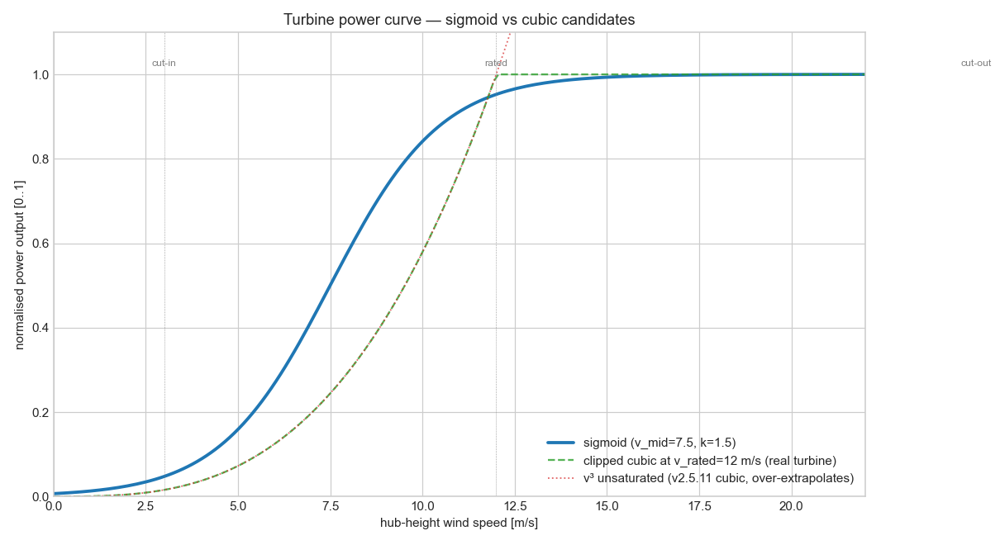
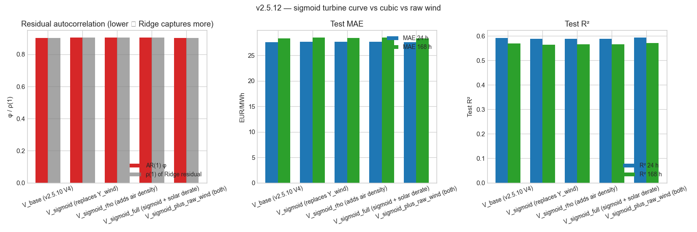

# v2.5.12 — Sigmoid turbine power curve

Replaces the v2.5.11 cubic ρ·v³ proxy with a sigmoid `P(v) = 1/(1 + exp(-(v - 7.5)/1.5))` that matches the actual S-shape of a turbine power curve (cut-in around 3 m/s, rated around 12 m/s, cut-out at 25 m/s).

## Sigmoid vs cubic candidates



## Variant comparison

| Variant | φ | ρ(1) | h=24 MAE/R²/CVaR | h=168 MAE/R²/CVaR |
|---|---:|---:|---|---|
| V_base (v2.5.10 V4) | +0.903 | +0.903 | 27.55 / +0.592 / +13.5% | 28.33 / +0.570 / +10.6% |
| V_sigmoid (replaces Y_wind) | +0.904 | +0.904 | 27.67 / +0.587 / +14.0% | 28.46 / +0.564 / +11.0% |
| V_sigmoid_rho (adds air density) | +0.904 | +0.904 | 27.64 / +0.589 / +14.0% | 28.44 / +0.565 / +11.1% |
| V_sigmoid_full (sigmoid + solar derate) | +0.904 | +0.904 | 27.65 / +0.589 / +14.1% | 28.46 / +0.565 / +11.1% |
| V_sigmoid_plus_raw_wind (both) | +0.903 | +0.903 | 27.54 / +0.593 / +13.7% | 28.31 / +0.571 / +10.8% |



## Reproducibility

```bash
python studies/v2512_sigmoid_turbine_curve.py
```