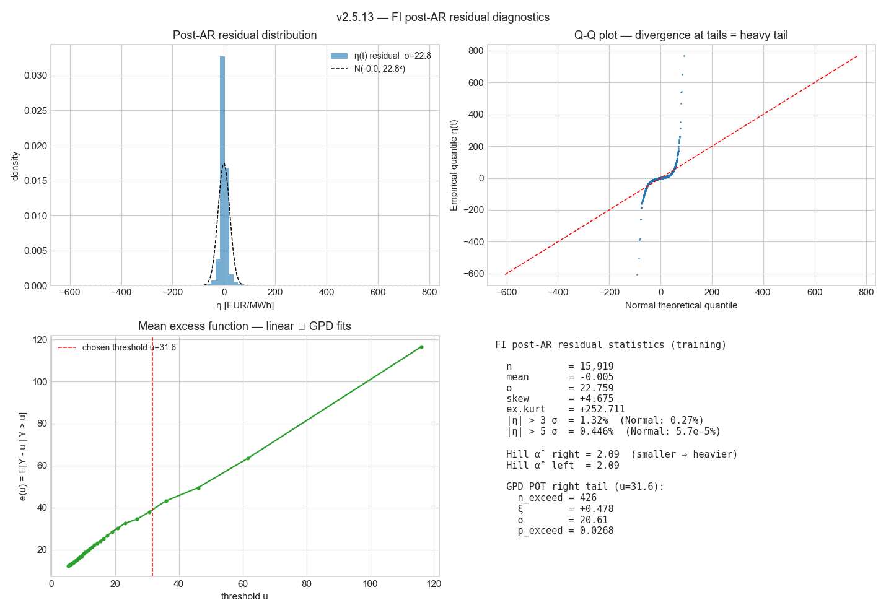
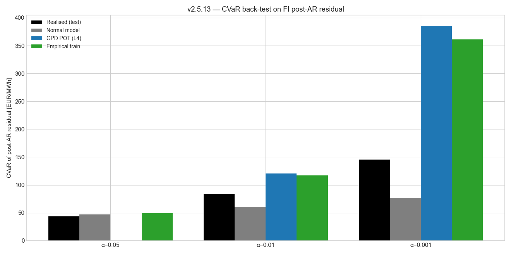

# v2.5.13 — Layer 4 GPD POT spike model

Applies the v2.5.2 GPD POT methodology to the FI post-AR(1) residual produced by the v2.5.12 V_sigmoid_full architecture.

**Window**: 2023-01-08 → 2026-04-27 (28,944 hourly rows)
**Train / test split**: chronological 55 / 45
**L1 + L2 + L3 architecture**:
  - L2 Ridge coefs (intercept, lag168, workday, sigmoid_wind_rho, solar_effective, Y_temp):
    `[+2.0471, +0.0662, +0.2136, -91.8699, -0.0214, -2.4327]`
  - L3 AR(1) φ = **+0.904**

## η(t) post-AR residual statistics (training)

- n = 15,919
- mean = -0.005, σ = 22.759
- skew = +4.675
- excess kurtosis = +252.71
- |η| > 3 σ frequency: 1.32 % (Gaussian baseline: 0.27 %)
- Hill α̂ right tail: **2.09**  (α̂ < 4 ⇒ infinite kurtosis ⇒ heavy)
- Hill α̂ left tail: 2.09

## GPD POT right-tail fit

- threshold u = 31.62
- shape ξ = **+0.478**  (ξ > 0 ⇒ heavy; ξ = 0 ⇒ exponential; ξ < 0 ⇒ bounded)
- scale σ = 20.61
- n exceedances = 426
- p_exceed = 0.0268

## CVaR back-test on held-out η_test

| α | Realised | Normal | GPD POT | Empirical train |
|---:|---:|---:|---:|---:|
| 0.050 | 43.56 | 46.95 | nan | 48.98 |
| 0.010 | 84.00 | 60.66 | 120.68 | 116.97 |
| 0.001 | 145.40 | 76.64 | 385.59 | 361.07 |

Interpretation: a model is **accurate** when its CVaR prediction matches realised. GPD POT closer to realised than Normal at low α (rare-spike tail) ⇒ Layer 4 is doing its job.

## Figures





## Persisted artifact

`custom_components/spot_price_predictor/data/spike_model_default.json` carries the frozen GPD POT parameters along with the parent L1+L2+L3 configuration that produced them. Runtime use: sample post-AR shocks via GPD inverse-CDF in the right tail; bulk uses Normal(μ, σ).

## Reproducibility

```bash
python studies/v2513_layer4_spike_model.py
```