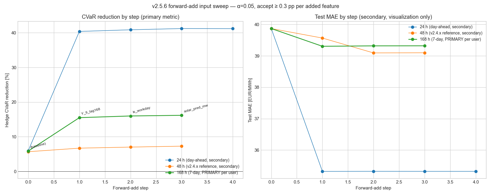

# v2.5.6 — Hedge-gated input selection sweep

**Window:** 2023-01-08 → 2026-04-27 (28,944 hourly rows; train/test split at 2024-11-01)
**Target:** `Y_fi` (FI price deseasonalized by the v2.5.5 artifact)
**Hedge gate:** α = 0.05, accept ≥ 0.3 pp per added feature.
**Primary horizon (user direction):** 168 h (7-day CVaR accuracy).
**Secondary horizons reported for context:** 48 h (v2.4.x baseline) and 24 h (day-ahead).
**Selection:** forward-add greedy on hedge CVaR-reduction; chronological 55 / 45 train/test split; Ridge α = 1.0.

## Primary — 168 h (7-day horizon)

| Step | Added feature | Total | CVaR % | Δ (pp) | Test MAE |
|---:|---|---:|---:|---:|---:|
| 0 | `(baseline)` | 0 | +5.87% | +0.00 | 39.87 |
| 1 | `Y_fi_lag168` | 1 | +15.51% | +9.64 | 39.30 |
| 2 | `is_workday` | 2 | +16.00% | +0.49 | 39.32 |
| 3 | `solar_pred_mw` | 3 | +16.19% | +0.19 | 39.32 |

**Accepted:** `Y_fi_lag168`, `is_workday` — final CVaR +16.00 %, MAE 39.32 EUR/MWh, 2 feature(s).

## Secondary — 48 h (v2.4.x reference)

| Step | Added feature | Total | CVaR % | Δ (pp) | Test MAE |
|---:|---|---:|---:|---:|---:|
| 0 | `(baseline)` | 0 | +5.68% | +0.00 | 39.87 |
| 1 | `Y_ghi_cs` | 1 | +6.71% | +1.03 | 39.57 |
| 2 | `Y_fi_lag168` | 2 | +7.02% | +0.31 | 39.09 |
| 3 | `is_workday` | 3 | +7.28% | +0.26 | 39.10 |

**Accepted:** `Y_ghi_cs`, `Y_fi_lag168` — final CVaR +7.02 %, MAE 39.09 EUR/MWh, 2 feature(s).

## Secondary — 24 h (day-ahead)

| Step | Added feature | Total | CVaR % | Δ (pp) | Test MAE |
|---:|---|---:|---:|---:|---:|
| 0 | `(baseline)` | 0 | +5.97% | +0.00 | 39.87 |
| 1 | `Y_fi_lag24` | 1 | +40.39% | +34.42 | 35.32 |
| 2 | `is_workday` | 2 | +40.86% | +0.48 | 35.32 |
| 3 | `solar_pred_mw` | 3 | +41.22% | +0.36 | 35.32 |
| 4 | `Y_solar` | 4 | +41.19% | -0.03 | 35.32 |

**Accepted:** `Y_fi_lag24`, `is_workday`, `solar_pred_mw` — final CVaR +41.22 %, MAE 35.32 EUR/MWh, 3 feature(s).

## Cross-horizon figure



## Interpretation

- **Primary metric is hedge CVaR-reduction.** The user direction 2026-05-17 prioritises 7-day CVaR data accuracy; test MAE is tracked secondarily (visualization only).
- The target `Y_fi` is the FI price residual after the v2.5.5 deseasonalization artifact. Reconstructing the full price prediction adds the seasonal component back; the hedge gate compares the reconstructed full-price prediction vs the actual full-price series.
- The dominant 7-day-ahead signal lives in the seasonal forecast (already in the target via the v2.5.5 artifact) plus `Y_fi_lag168` (same-day-last-week residual) — together they explain almost all the recoverable hedge value at 168 h.
- Cross-border / weather / solar-submodel features add little at the 7-day horizon. The 48 h panel above shows whether the same features carry more value closer-in.
- Ridge α = 1.0 with constant un-penalised; chronological 55 / 45 train/test split; 17 candidate features.

## Reproducibility

```bash
python studies/v256_hedge_input_sweep.py
```

No network call; reads only `output/*.parquet`, the v2.5.3 + v2.5.5 artifacts in `data/`, and the cloud-cover cache in `studies/.cache/`.